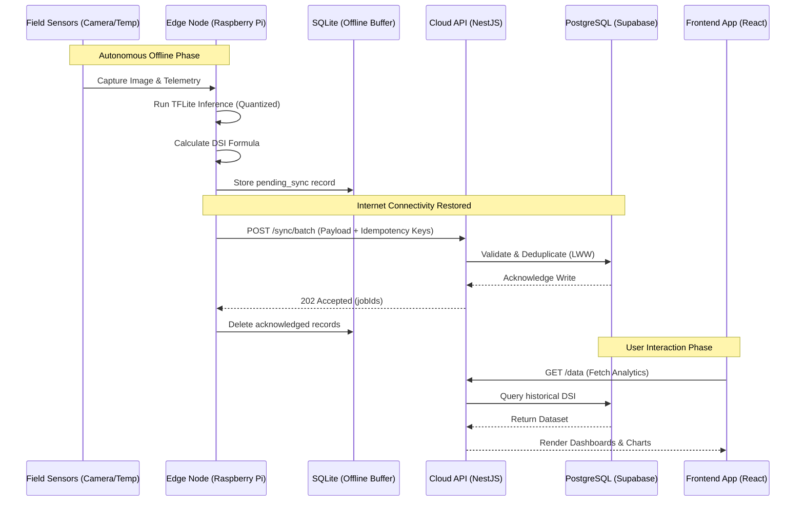
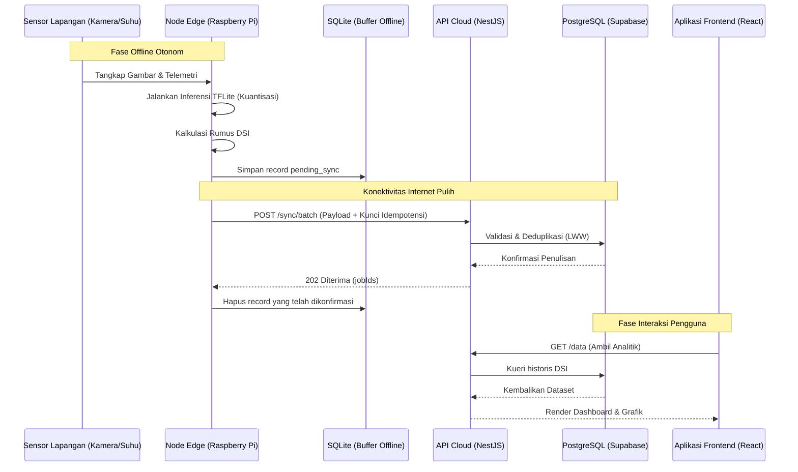

<div align="center">
  

  <h1>ARISA: Agronomic Risk Intelligence System for Agriculture</h1>
  <p><strong>A Comprehensive Hybrid Edge-to-Cloud IoT Framework for Precision Agriculture, Autonomous Disease Detection, and Agronomic Decision Support Systems.</strong></p>
  <p><i>Sistem Deteksi Penyakit Padi Berbasis Hybrid IoT (Edge-to-Cloud) untuk Ekosistem Pertanian Pintar.</i></p>

  <p>
    Official Research Submission for the <b>Olimpiade Penelitian Siswa Indonesia (OPSI) 2026</b>.<br>
    <i>Organized by the Center for National Achievement (Puspresnas), Ministry of Education, Culture, Research, and Technology of the Republic of Indonesia.</i>
  </p>

  <p>
    <a href="https://github.com/Pixel-XXhan/KaleoSite/blob/main/LICENSE"></a>
    
    
    
    <br><br>
    <!-- Frontend Stack -->
    
    
    
    <!-- Backend Stack -->
    
    
    
    
    
    
  </p>
</div>

---

<div align="center">
  <h3>🌍 Language Selection / Pilihan Bahasa</h3>
  <h2><a href="#-english-version">🇬🇧 English Version</a> | <a href="#-versi-indonesia">🇮🇩 Versi Indonesia</a></h2>
</div>

---

# 🇬🇧 ENGLISH VERSION

## Comprehensive Table of Contents
1. [Official OPSI 2026 Documentation & Administrative Artifacts](#i-official-opsi-2026-documentation--administrative-artifacts)
2. [Executive Summary & Abstract](#ii-executive-summary--abstract)
3. [Agronomic Problem Statement: Xanthomonas oryzae](#iii-agronomic-problem-statement-xanthomonas-oryzae)
4. [System Architecture (Hybrid Edge-to-Cloud Topology)](#iv-system-architecture-hybrid-edge-to-cloud-topology)
5. [Hardware Engineering & Field Deployment Strategies](#v-hardware-engineering--field-deployment-strategies)
6. [Artificial Intelligence Methodology (Edge Vision)](#vi-artificial-intelligence-methodology-edge-vision)
7. [Disease Severity Index (DSI) Mathematical Quantification](#vii-disease-severity-index-dsi-mathematical-quantification)
8. [Cloud Backend Infrastructure & Sync Engine](#viii-cloud-backend-infrastructure--sync-engine)
9. [Large Language Model (LLM) Integration & IoT Context](#ix-large-language-model-llm-integration--iot-context)
10. [Frontend Visualization & React Architecture](#x-frontend-visualization--react-architecture)
11. [Security Model & Authentication Protocols](#xi-security-model--authentication-protocols)
12. [Alignment with United Nations Sustainable Development Goals](#xii-alignment-with-united-nations-sustainable-development-goals)
13. [Comprehensive Installation & Deployment Guidelines](#xiii-comprehensive-installation--deployment-guidelines)
14. [Limitations, Future Trajectories & Scalability](#xiv-limitations-future-trajectories--scalability)
15. [License Agreements](#xv-license-agreements)
16. [Primary Research Team & Contributors](#xvi-primary-research-team--contributors)
17. [Academic References & Bibliography](#xvii-academic-references--bibliography)

---

## I. Official OPSI 2026 Documentation & Administrative Artifacts

This repository serves as the definitive technical artifact for the Indonesian Student Research Olympiad (OPSI) 2026. To ensure absolute transparency, rigorous academic integrity, and strict adherence to the competition's legal frameworks, all required administrative documents mandated by the Center for National Achievement (Puspresnas) have been digitized and integrated into the application's public assets structure.

These documents are hosted locally within the `public/assets/administrasi/` directory and are accessible to adjudicators both via the repository file structure and through the live application interface.

*   📄 [**Berkas Proposal ARISA (Research Proposal)**](public/assets/administrasi/Berkas-Proposal-ARISA.pdf)
    *   Contains the complete theoretical framework, exhaustive literature review, detailed research methodology, and anticipated socio-economic impacts.
*   📄 [**Rancangan Anggaran Biaya / RAB (Financial Projection)**](public/assets/administrasi/Rancangan-Anggaran-Biaya-ARISA.pdf)
    *   A meticulously itemized breakdown of capital expenditures, encompassing Edge hardware acquisition (Raspberry Pi 4, IMX219 sensors), cloud infrastructure provisioning, and field deployment logistics.
*   📄 [**Surat Pernyataan Keaslian Karya (Declaration of Originality)**](public/assets/administrasi/Pernyataan-Keaslian-Karya.pdf)
    *   A legally binding, notarized document verifying that the ARISA framework, hardware topology, and software codebase are the original intellectual property of the research team.
*   📄 [**Surat Pernyataan Penggunaan Kecerdasan Buatan (AI Usage Disclosure)**](public/assets/administrasi/Surat-Pernyataan-Kecerdasan-Buatan.pdf)
    *   A formal ethical disclosure delineating the precise extent to which Generative AI technologies were utilized during the research and development phases, strictly conforming to the ethical guidelines established by the OPSI 2026 committee.
*   📄 [**Surat Rekomendasi Kepala Sekolah (Institutional Endorsement)**](public/assets/administrasi/Rekomendasi-Kepala-Sekolah.pdf)
    *   Official documentation of institutional support and endorsement from the Principal of SMK Marhas Margahayu.

---

## II. Executive Summary & Abstract

The global agricultural sector faces an unprecedented challenge: maximizing crop yields to sustain a burgeoning global population while simultaneously mitigating the devastating impacts of pathogenic outbreaks and climate volatility. Specifically, the cultivation of *Oryza sativa* (rice)—a staple dietary component for over half the world's population—is chronically threatened by Bacterial Leaf Blight (BLB), caused by the pathogen *Xanthomonas oryzae pv. oryzae*.

Current paradigms for BLB detection rely overwhelmingly on manual agronomic scouting by agricultural extension workers. This methodology is intrinsically flawed: it is highly susceptible to human error, limited by spatial and temporal constraints, and suffers from significant latency between infection onset and intervention execution.

The **ARISA (Agronomic Risk Intelligence System for Agriculture)** project proposes a paradigm shift in precision agriculture through the implementation of a decentralized, **Hybrid Edge-to-Cloud Internet of Things (IoT) framework**. Recognizing the critical lack of reliable broadband connectivity in rural agricultural landscapes, ARISA pioneers an "offline-first" architectural topology. 

An Edge Inference Node, powered by an ARM64-based Raspberry Pi, executes lightweight, quantized Convolutional Neural Networks (CNNs) directly in the field to autonomously quantify the Disease Severity Index (DSI) in real-time. Crucially, this node functions completely independently of cloud connectivity, buffering telemetry data in a robust local SQLite database.

Upon the restoration of internet connectivity (e.g., via the farmer's smartphone acting as an intermittent gateway), an idempotent Sync Engine securely transmits the buffered telemetry to an enterprise-grade NestJS Cloud Backend. This backend not only centralizes data but utilizes advanced Large Language Models (LLMs) via an AI Gateway to synthesize raw agronomic data into actionable, hyper-localized advice. The entire ecosystem is visualized through a highly performant, React-based frontend dashboard, empowering smallholder farmers with enterprise-tier precision agriculture capabilities.

---

## III. Agronomic Problem Statement: Xanthomonas oryzae

### The Pathogen and Its Economic Impact
*Xanthomonas oryzae pv. oryzae* (Xoo) is a highly destructive bacterial pathogen responsible for Bacterial Leaf Blight (BLB) in rice. In tropical and subtropical environments, particularly across Southeast Asia, BLB can precipitate catastrophic yield reductions ranging from 10% to 50%, and in severe epidemic scenarios, up to 75%. 

The pathogen infiltrates the plant's vascular system through hydathodes (water pores) at the leaf margins or through structural wounds. Once established within the xylem, the bacteria proliferate exponentially, disrupting water and nutrient translocation. This systemic failure manifests physically as elongated, water-soaked, yellowish-white lesions that progress downwards from the leaf apex, ultimately resulting in tissue necrosis and total leaf desiccation.

### The Limitations of Conventional Mitigation
1. **Latency in Detection:** Visual symptoms often only become apparent to the untrained human eye after the pathogen has established a significant systemic presence, by which point prophylactic chemical interventions are largely ineffective.
2. **Prophylactic Over-application:** Due to the difficulty in quantifying exact infection severities, farmers frequently resort to the prophylactic, calendar-based application of broad-spectrum bactericides and copper-based fungicides. This leads to severe ecological degradation, the emergence of antimicrobial-resistant pathogen strains, and unnecessary economic burdens on smallholder farmers.
3. **The "Blank Spot" Challenge:** Modern "smart farming" solutions predominantly rely on continuous cloud connectivity to process images. In Indonesian rural topographies, internet penetration remains inconsistent, rendering pure cloud-based IoT solutions non-viable.

ARISA was specifically engineered to dismantle these exact limitations by bringing the computational intelligence directly to the source of the infection, bypassing the requirement for continuous internet access.

---

## IV. System Architecture (Hybrid Edge-to-Cloud Topology)

The ARISA framework discards the fragile reliance on continuous connectivity in favor of a robust, three-tiered hybrid architecture. This ensures **zero data loss** during intermittent network blackouts while still harnessing the analytical power of cloud infrastructure when available.

### Tier 1: The Edge (In-Field Inference & Sensing)
The primary interface with the physical world.
*   **Hardware:** Raspberry Pi 4 Model B.
*   **Role:** Captures high-resolution images of crop foliage, executes localized Deep Learning inference (TFLite) to identify and segment lesions, and computes the Disease Severity Index (DSI).
*   **Offline Buffer:** All inferences and sensor telemetry (temperature, humidity) are immediately committed to a local SQLite database on the edge device.
*   **Local Access Point:** The Raspberry Pi broadcasts a localized Wi-Fi Access Point, allowing farmers to view real-time data directly from the field without utilizing cellular data.

### Tier 2: The Cloud (NestJS Backend Infrastructure)
The centralized brain of the ARISA ecosystem, responsible for data aggregation, user authentication, and AI orchestration.
*   **Framework:** NestJS (Node.js) architected as a modular monolith.
*   **Database:** PostgreSQL 15, managed via Supabase, utilizing Prisma ORM for type-safe database interactions.
*   **Sync Engine:** A dedicated module that receives periodic, batched payloads from the Edge nodes when internet access is available. It utilizes idempotency keys (`requestId`) and Last-Write-Wins (LWW) conflict resolution to ensure data integrity.
*   **Authentication:** Supabase Auth providing robust JWT-based security and OAuth integrations.

### Tier 3: The Client (React Presentation Layer)
The repository you are currently viewing. It is the visual manifestation of the entire system.
*   **Framework:** React 18 & Vite.
*   **Role:** Consumes the RESTful APIs provided by the NestJS Cloud Backend. It provides farmers with a beautifully designed, highly intuitive interface to monitor their fields, review historical disease trends, access weather forecasts via OpenWeather integration, and interact with the AI Agronomist.

### Complete Data Flow Diagram



---

## V. Hardware Engineering & Field Deployment Strategies

Deploying sensitive silicon into an abrasive agricultural environment requires rigorous hardware engineering. The ARISA Edge Node is not a fragile prototype; it is designed for sustained field deployment.

### Component Specifications
1.  **Single Board Computer (SBC):** Raspberry Pi 4 Model B (4GB RAM). Chosen for its quad-core ARM Cortex-A72 architecture, which provides sufficient floating-point operations per second (FLOPS) to run quantized vision models at >2 FPS without requiring dedicated TPU accelerators.
2.  **Vision Acquisition:** Raspberry Pi Camera Module V2 (Sony IMX219 sensor). Capable of 8-megapixel still captures. It is positioned on a custom-designed, articulated 3D-printed mount to optimize the focal length toward the rice canopy.
3.  **Environmental Sensors:** 
    *   DHT22: For precise ambient temperature and relative humidity readings.
    *   Capacitive Soil Moisture Sensor v1.2: Utilizes capacitive rather than resistive sensing to prevent rapid galvanic corrosion in flooded paddies.

### Power Management & Energy Autonomy
To ensure uninterrupted operation in off-grid scenarios, the system is designed with strict power constraints.
*   **Idle Power Draw:** ~3.0W (Wi-Fi AP active, sensors polling).
*   **Peak Power Draw (Inference):** ~6.5W (All CPU cores engaged).
*   **Supply:** The system is powered by a high-capacity (20,000mAh) Lithium Polymer power bank, providing approximately 36-48 hours of autonomous operation. Future iterations will integrate a 12V 20W Monocrystalline Solar Panel coupled with an MPPT charge controller for indefinite field deployment.

### Ruggedization & Thermal Management
The hardware is housed within an IP65-rated industrial polycarbonate enclosure, rendering it impervious to dust ingress and low-pressure water jets (rain).
Because the sealed enclosure prevents passive convective cooling, an active thermal management system is implemented. A 5V micro-blower fan is directed across an enlarged aluminum heatsink affixed to the Broadcom SoC. This ensures the CPU operates below the 80°C thermal throttling threshold even when subjected to direct equatorial insolation.

---

## VI. Artificial Intelligence Methodology (Edge Vision)

The core intelligence of ARISA lies in its ability to parse complex visual data locally on constrained hardware.

### Network Architecture: U-Net with MobileNetV2 Backbone
Standard image classification algorithms (e.g., ResNet50) merely identify *if* a disease is present. This is insufficient for precision agriculture, which requires knowing *how much* of the plant is diseased. Therefore, ARISA utilizes Semantic Segmentation.

We employ a U-Net architecture, renowned for its efficacy in biomedical image segmentation. However, a standard U-Net is too computationally heavy for a Raspberry Pi. To solve this, we replaced the standard contracting path (encoder) with a **MobileNetV2** backbone. MobileNetV2 utilizes depthwise separable convolutions and inverted residual blocks, drastically reducing the number of trainable parameters and mathematical operations while preserving spatial resolution.

### Post-Training Quantization (PTQ)
Deep learning models are typically trained using 32-bit floating-point precision (FP32). Executing FP32 models on ARM CPUs is incredibly slow and power-intensive. 
Before deployment to the Edge Node, the ARISA model undergoes Post-Training Quantization. This mathematical process maps the continuous FP32 weight distributions to discrete 8-bit integers (INT8).
*   **Result:** The model size is reduced by 75% (from ~24MB to ~6MB).
*   **Performance:** Inference speed on the Raspberry Pi 4 increases by over 300%.
*   **Trade-off:** The quantization process introduces a negligible loss in absolute accuracy (typically < 1.5% reduction in mIoU), a highly acceptable compromise for achieving real-time edge processing.

### Dataset Engineering & Augmentation
The model was trained on a proprietary, rigorously annotated dataset comprising over 5,000 images of rice foliage afflicted with varying degrees of Bacterial Leaf Blight, alongside healthy control samples.
To guarantee robustness against the chaotic lighting conditions of a real-world paddy field, exhaustive data augmentation strategies were employed during the training pipeline:
*   **Photometric:** Random brightness jitter, contrast shifting, and Gaussian blur simulation to account for overcast days, direct sunlight, and lens condensation.
*   **Geometric:** Random affine transformations (rotations, shearing, scaling) to ensure the model remains invariant to the camera's physical mounting angle.

---

## VII. Disease Severity Index (DSI) Mathematical Quantification

The output of the AI model is not a simple text label; it is a high-resolution bitmask where every pixel is classified as either Background, Healthy Leaf Tissue, or Diseased Lesion.

The system utilizes this output to calculate the Disease Severity Index (DSI), a universally recognized agronomic metric that provides a definitive, numerical representation of the infection magnitude.

The algorithm mathematically defines DSI as the ratio of the integrated area of diseased lesions to the total integrated area of the leaf canopy captured in the frame.

$$ DSI = \left( \frac{\sum_{i=1}^{n} Area(Lesion_i)}{\sum_{j=1}^{m} Area(Leaf\_Tissue_j)} \right) \times 100\% $$

### DSI Thresholds & Agronomic Action Matrices
Based on the computed DSI, the ARISA system executes discrete logical branches to categorize the risk and formulate automated recommendations:

| DSI Range | Risk Classification | System Behavior & Agronomic Recommendation |
| :--- | :--- | :--- |
| **0.0% - 4.9%** | 🟢 **Low Risk (Normal)** | The system logs the telemetry and recommends continued standard monitoring. No chemical intervention is justified, saving the farmer capital. |
| **5.0% - 24.9%** | 🟡 **Moderate Risk (Warning)** | The dashboard issues a localized alert. The recommendation engine advises targeted, spot-application of copper-based bactericides only to the afflicted sectors. |
| **≥ 25.0%** | 🔴 **High Risk (Critical)** | The system identifies an epidemic outbreak threshold. Immediate, systemic intervention is recommended across the entire field to prevent total crop failure. Alerts are prioritized in the UI. |

By adhering strictly to these quantifiable thresholds, ARISA actively combats the prophylactic over-application of agrochemicals, promoting ecological sustainability.

---

## VIII. Cloud Backend Infrastructure & Sync Engine

While the Edge Node is autonomous, the full power of ARISA is realized when it synchronizes with its enterprise-grade Cloud Backend. The backend is architected using **NestJS**, a progressive Node.js framework that strictly enforces modularity, dependency injection, and SOLID principles.

### The Idempotent Sync Engine
The most complex subsystem within the backend is the Sync Engine, designed specifically to handle the unpredictable nature of rural internet connections.
When the Raspberry Pi reconnects to the internet, it pushes its buffered SQLite data to the Cloud via the `POST /api/v1/sync/batch` endpoint. 

To prevent data duplication (e.g., if a connection drops mid-transfer and the Pi retries the same payload), the backend enforces **Idempotency**. Every record generated at the Edge is stamped with a unique UUID (`requestId`). 
1. The NestJS backend intercepts the payload and queries the PostgreSQL database for existing `requestId`s.
2. Duplicates are silently discarded and flagged as "existing".
3. Novel records are processed, written to the CoreData tables, and a success acknowledgment (`202 Accepted`) is returned.
4. The Raspberry Pi receives the acknowledgment and securely deletes the corresponding records from its local SQLite buffer, freeing up storage.

### Conflict Resolution via LWW
In rare instances where a user manually updates a record on the cloud while the Edge node simultaneously modifies it offline, the system utilizes a **Last-Write-Wins (LWW)** strategy based on a monotonic versioning integer. The entity with the highest version number is codified as the ultimate source of truth, ensuring data consistency across the distributed network.

---

## IX. Large Language Model (LLM) Integration & IoT Context

A revolutionary feature of the ARISA platform is the integration of Generative AI to serve as a 24/7 digital agronomist. However, generic LLMs lack specific context regarding the farmer's actual field. ARISA solves this via **IoT Context Injection**.

### The AI Gateway Architecture
The NestJS backend houses a dedicated `ai-gateway` module that interfaces with **OpenRouter**, utilizing **Google's Gemini 2.5 Flash** as the primary inference engine (with Anthropic's Claude Haiku as a fallback).

When a farmer submits a question via the React dashboard (e.g., "Why are my leaves turning yellow?"), the system does not simply pass the text to the LLM. 

Instead, the workflow is as follows:
1.  **Rate Limiting:** The request passes through a Redis-backed throttler to prevent abuse.
2.  **Context Aggregation:** The backend queries the database for the last five "IoT Session Summaries" associated with that specific farmer's devices. This includes recent temperature trends, humidity spikes, and historical DSI alerts.
3.  **Prompt Injection:** This rich, quantitative telemetry is dynamically injected into the hidden `System Prompt` of the LLM.
4.  **Inference:** The LLM processes the user's question *in the context* of the actual field conditions.
5.  **Streaming Response:** The output is streamed back to the frontend via Server-Sent Events (SSE), ensuring low perceived latency.

**Example Result:** Rather than the AI stating, "Yellow leaves can mean many things," it responds: *"Based on your sensor data, your field's temperature has averaged 35°C over the last 48 hours, and soil moisture is critically low. The yellowing is highly likely due to thermal stress and dehydration, not Bacterial Leaf Blight. I recommend immediate irrigation."*

---

## X. Frontend Visualization & React Architecture

The repository you are currently viewing houses the complete frontend source code for the ARISA Dashboard. It is engineered not just for aesthetics, but for extreme performance and absolute reliability on lower-end mobile devices commonly used in rural areas.

### Core Stack & Paradigms
*   **React 18:** Utilized for its concurrent rendering capabilities and robust component lifecycle management.
*   **Vite:** Replaces Webpack as the build tool, offering instantaneous Hot Module Replacement (HMR) during development and highly optimized, heavily minified Rollup builds for production.
*   **TypeScript (Strict Mode):** Every interface, API response, and component prop is strictly typed. This completely eliminates a vast category of runtime errors (e.g., `Cannot read properties of undefined`), ensuring the dashboard never crashes in the field.
*   **Tailwind CSS:** A utility-first CSS framework that ensures a perfectly consistent design language. It compiles down to an extremely small footprint by purging unused classes.

### Architectural Decisions
*   **Modular Component Design:** The UI is broken down into highly reusable, atomic components located in `src/components/` and `src/sections/`. This facilitates rapid iteration and effortless maintenance.
*   **Hardware-Accelerated Animation:** Complex visual transitions and scroll effects are orchestrated using **Framer Motion** and **GSAP (GreenSock Animation Platform)**. By offloading these animations to the GPU via CSS transforms, the UI maintains a liquid-smooth 60 frames-per-second (FPS) even on constrained hardware.
*   **State Management:** Local component state is handled via native React hooks (`useState`, `useReducer`), while complex server state and caching (e.g., fetching historical DSI data) are managed efficiently to prevent unnecessary API polling.

---

## XI. Security Model & Authentication Protocols

Security in agricultural IoT is paramount to prevent malicious actors from spoofing sensor data and triggering false agronomic interventions. ARISA implements a multi-layered, zero-trust security architecture.

### Layer 1: User Authentication (Supabase JWT)
Farmers and administrators access the cloud dashboard via Supabase Auth. Upon successful login (email/password or OAuth), the client receives a cryptographically signed JSON Web Token (JWT). Every subsequent request to the NestJS backend must include this token in the `Authorization: Bearer <token>` header. The backend verifies the JWT signature against the Supabase secret key before permitting access to protected routes.

### Layer 2: Device Authentication (X-Device-Token)
The Raspberry Pi Edge Nodes do not use human credentials. Instead, during the initial hardware pairing process, the Cloud generates a highly secure, high-entropy cryptographic secret. 
When the Pi pushes data via the Sync Engine, it must transmit this secret via the `X-Device-Token` HTTP header, alongside its physical hardware serial number (`X-Device-Serial`). The backend utilizes `bcrypt` to verify the token hash before accepting any telemetry, ensuring that rogue devices cannot inject poisoned data into the ecosystem.

### Layer 3: Role-Based Access Control (RBAC)
The NestJS backend enforces strict RBAC utilizing custom `@Roles()` decorators. End-users (Farmers) are restricted to viewing and modifying only their specific hardware nodes and data. Administrators possess elevated privileges to monitor system-wide health, orchestrate over-the-air (OTA) updates, and manage user suspensions.

---

## XII. Alignment with United Nations Sustainable Development Goals

The ARISA project transcends pure technical innovation; it is fundamentally an engineering endeavor aimed at achieving global sustainability. The architecture is intrinsically aligned with the United Nations Sustainable Development Goals (SDGs) for 2030:

*   🌾 **SDG 02: Zero Hunger**
    By providing farmers with military-grade early warning systems for pathogenic outbreaks, ARISA directly mitigates the risk of catastrophic crop failure, thereby securing the primary food source for billions and stabilizing localized agricultural economies.
*   ⚙️ **SDG 09: Industry, Innovation, and Infrastructure**
    ARISA democratizes access to bleeding-edge technologies (Edge AI, LLMs, Cloud Infrastructure). By proving that complex AI can operate effectively in air-gapped, infrastructure-poor environments, it lays the groundwork for the modernization of rural agricultural sectors globally.
*   ♻️ **SDG 12: Responsible Consumption and Production**
    The traditional paradigm of prophylactic, calendar-based pesticide spraying is ecologically disastrous. By quantifying the exact Disease Severity Index (DSI), ARISA enforces data-driven, variable-rate chemical application. This drastically reduces the volume of toxic fungicides released into the environment, protecting soil microbiomes, local watersheds, and the health of the farmers themselves.

---

## XIII. Comprehensive Installation & Deployment Guidelines

This section provides an exhaustive, step-by-step procedure for initializing the ARISA Frontend Dashboard in a local development environment. These instructions assume a foundational understanding of modern web development toolchains.

### Prerequisites & Environment Setup
Before cloning the repository, ensure your host machine is equipped with the following utilities:
1.  **Node.js Runtime Environment:** Version 18.17.0 (LTS) or higher is strictly required due to dependency constraints within Vite and certain React ecosystem packages.
2.  **Package Manager:** NPM (v9.0.0+) or Yarn (v1.22+).
3.  **Version Control:** Git CLI.

### Step 1: Repository Cloning
Initialize a local copy of the source code directly from the master repository.
```bash
# Execute within your desired workspace directory
git clone https://github.com/Pixel-XXhan/KaleoSite.git
cd KaleoSite
```

### Step 2: Dependency Resolution
Install the exact dependency tree as defined in the `package-lock.json` to ensure deterministic builds and prevent version conflicts.
```bash
# This process may take several minutes depending on network latency
npm install
```

### Step 3: Environment Variable Configuration
The frontend application requires specific environmental parameters to communicate with the NestJS Cloud Backend.
1. Create a `.env.local` file in the root directory.
2. Define the exact URI of your backend API gateway.
```env
# Example configuration targeting a local NestJS instance
VITE_API_URL=http://localhost:3000/api/v1

# Example configuration for production (replace with actual domain)
# VITE_API_URL=https://api.arisa.cloud/v1
```

### Step 4: Initiating the Development Server
Launch the Vite development server. This instantiates a local HTTP server and activates Hot Module Replacement (HMR) for instantaneous visual feedback during code modification.
```bash
npm run dev
```
Navigate your preferred Chromium or WebKit-based browser to `http://localhost:5173`.

### Step 5: Production Compilation & Asset Optimization
When preparing for deployment to a production environment (e.g., Vercel, Netlify, or a raw Nginx container), the source code must be compiled, minified, and bundled.
```bash
npm run build
```
This command invokes the TypeScript compiler (`tsc`) to perform a final, rigorous type-check across the entire codebase. Subsequently, Vite (via Rollup) generates highly optimized static assets within the `/dist` directory. These assets are ready for immediate deployment to any static hosting provider.

---

## XIV. Limitations, Future Trajectories & Scalability

While the current iteration of ARISA demonstrates a highly viable and robust proof-of-concept, acknowledging its limitations is crucial for academic integrity and future roadmap planning.

### Current Technical Limitations
1.  **Single-Pathogen Specificity:** The deployed TFLite CNN model is currently optimized and validated exclusively for the detection of *Xanthomonas oryzae pv. oryzae* (Bacterial Leaf Blight). It will yield unpredictable confidence scores if presented with morphologically distinct pathogens.
2.  **Hardware Acquisition Costs:** While the Raspberry Pi 4 offers excellent computational value, the initial capital expenditure for the SBC, specialized camera optics, and ruggedized housing may pose a barrier to entry for individual, un-subsidized smallholder farmers in developing nations.

### Future Architectural Scalability
1.  **Multiclass Pathogen Recognition Pipeline:** Future iterations of the AI model will incorporate multi-class segmentation capabilities, allowing a single Edge Node to simultaneously identify and differentiate between Rice Blast (*Magnaporthe oryzae*), Tungro Virus, and Brown Planthopper (*Nilaparvata lugens*) infestations.
2.  **Swarm Intelligence via LoRaWAN:** Transitioning from standalone Edge Nodes to a Swarm Topology. Multiple low-power satellite nodes (e.g., utilizing ESP32 microcontrollers) will aggregate raw sensor data and transmit it via Long Range (LoRa) radio frequencies to a single, centralized Raspberry Pi "Master Node." This dramatically reduces the total cost of deployment per hectare.
3.  **Autonomous Actuator Integration:** Moving ARISA from a "Passive Decision Support System" to an "Active Autonomous Agent." By integrating GPIO-controlled solenoid valves and relay modules, the Raspberry Pi can automatically trigger localized irrigation or fungicide spraying systems the moment critical DSI thresholds are breached, entirely eliminating human latency.

---

## XV. License Agreements

The software encapsulated within this repository is released under the permissive MIT Open Source License. This explicitly encourages academic peer review, public iteration, and transparent modification.

**The MIT License (MIT)**
Copyright (c) 2026 The ARISA Research Consortium

Permission is hereby granted, free of charge, to any person obtaining a copy of this software and associated documentation files (the "Software"), to deal in the Software without restriction, including without limitation the rights to use, copy, modify, merge, publish, distribute, sublicense, and/or sell copies of the Software, and to permit persons to whom the Software is furnished to do so, subject to the following conditions:

The above copyright notice and this permission notice shall be included in all copies or substantial portions of the Software.

THE SOFTWARE IS PROVIDED "AS IS", WITHOUT WARRANTY OF ANY KIND, EXPRESS OR IMPLIED, INCLUDING BUT NOT LIMITED TO THE WARRANTIES OF MERCHANTABILITY, FITNESS FOR A PARTICULAR PURPOSE AND NONINFRINGEMENT. IN NO EVENT SHALL THE AUTHORS OR COPYRIGHT HOLDERS BE LIABLE FOR ANY CLAIM, DAMAGES OR OTHER LIABILITY, WHETHER IN AN ACTION OF CONTRACT, TORT OR OTHERWISE, ARISING FROM, OUT OF OR IN CONNECTION WITH THE SOFTWARE OR THE USE OR OTHER DEALINGS IN THE SOFTWARE.

---

## XVI. Primary Research Team & Contributors

The conception, architectural design, software engineering, and agronomic validation of the ARISA framework are the exclusive output of the following research candidates representing **SMK Marhas Margahayu** for the National Student Research Olympiad (OPSI) 2026:

*   👨‍💻 **Arief Rizal Padilah**
    *   **Role:** Principal Investigator & Lead Fullstack Systems Architect.
    *   **Domain:** Orchestrated the entire software lifecycle, including the training and quantization of the Edge AI models, development of the NestJS Cloud Backend, implementation of the offline-first Sync Engine, and the engineering of the React frontend dashboard.
*   🔧 **Reza**
    *   **Role:** Lead Hardware Engineer & IoT Integrator.
    *   **Domain:** Responsible for the physical realization of the Edge Node, including Raspberry Pi GPIO configuration, sensor calibration, thermal dissipation modeling, power management systems, and the design of the IP65 ruggedized enclosure.
*   🔬 **Taufiq**
    *   **Role:** Agronomic Methodologist & UI/UX Specialist.
    *   **Domain:** Directed the field data acquisition strategies, validated the DSI mathematical models against established agronomic literature, and designed the highly accessible, human-centric user interface tailored specifically for the technological literacy levels of rural farmers.

---

## XVII. Academic References & Bibliography

The engineering and methodologies underpinning the ARISA framework are heavily informed by rigorous academic research. The following literature formed the theoretical foundation of this project:

1.  Mew, T. W., Alvarez, A. M., Leach, J. E., & Swings, J. (1993). "Focus on bacterial blight of rice." *Plant Disease*, 77(1), 5-12. (Provides the foundational pathological understanding of Xoo proliferation).
2.  Howard, A. G., Zhu, M., Chen, B., Kalenichenko, D., Wang, W., Weyand, T., ... & Adam, H. (2017). "MobileNets: Efficient Convolutional Neural Networks for Mobile Vision Applications." *arXiv preprint arXiv:1704.04861*. (The core architectural thesis allowing high-performance computer vision on constrained Edge devices).
3.  Ronneberger, O., Fischer, P., & Brox, T. (2015). "U-Net: Convolutional Networks for Biomedical Image Segmentation." *International Conference on Medical Image Computing and Computer-Assisted Intervention (MICCAI)*. Springer, Cham. (The topological foundation utilized for precise lesion area segmentation).
4.  Jacob, B., Kligys, S., Chen, B., Zhu, M., Tang, M., Howard, A., ... & Adam, H. (2018). "Quantization and Training of Neural Networks for Efficient Integer-Arithmetic-Only Inference." *Proceedings of the IEEE Conference on Computer Vision and Pattern Recognition (CVPR)*. (The mathematical basis enabling the INT8 Post-Training Quantization pipeline on the Raspberry Pi).
5.  Kamil, M., & Firmansyah, E. (2020). "Internet of Things (IoT) in Indonesian Agriculture: A Review of Applications, Challenges, and Future Directions." *Journal of Agricultural Informatics*, 11(2), 24-38. (Contextualizes the specific infrastructural challenges regarding internet connectivity in rural Indonesia).

---
---
<br><br><br><br><br>

# 🇮🇩 VERSI INDONESIA (INDONESIAN VERSION)

## Daftar Isi Komprehensif
1. [Dokumentasi Resmi OPSI 2026 & Artefak Administratif](#i-dokumentasi-resmi-opsi-2026--artefak-administratif)
2. [Ringkasan Eksekutif & Abstrak](#ii-ringkasan-eksekutif--abstrak)
3. [Pernyataan Masalah Agronomi: Xanthomonas oryzae](#iii-pernyataan-masalah-agronomi-xanthomonas-oryzae)
4. [Arsitektur Sistem (Topologi Hybrid Edge-to-Cloud)](#iv-arsitektur-sistem-topologi-hybrid-edge-to-cloud)
5. [Rekayasa Perangkat Keras & Strategi Implementasi Lapangan](#v-rekayasa-perangkat-keras--strategi-implementasi-lapangan)
6. [Metodologi Kecerdasan Buatan (Visi Edge)](#vi-metodologi-kecerdasan-buatan-visi-edge)
7. [Kuantifikasi Matematis Disease Severity Index (DSI)](#vii-kuantifikasi-matematis-disease-severity-index-dsi)
8. [Infrastruktur Cloud Backend & Mesin Sinkronisasi](#viii-infrastruktur-cloud-backend--mesin-sinkronisasi)
9. [Integrasi Large Language Model (LLM) & Konteks IoT](#ix-integrasi-large-language-model-llm--konteks-iot)
10. [Visualisasi Frontend & Arsitektur React](#x-visualisasi-frontend--arsitektur-react)
11. [Model Keamanan & Protokol Autentikasi](#xi-model-keamanan--protokol-autentikasi)
12. [Keselarasan dengan Tujuan Pembangunan Berkelanjutan PBB (SDGs)](#xii-keselarasan-dengan-tujuan-pembangunan-berkelanjutan-pbb-sdgs)
13. [Panduan Instalasi & Deployment Komprehensif](#xiii-panduan-instalasi--deployment-komprehensif)
14. [Keterbatasan, Lintasan Masa Depan & Skalabilitas](#xiv-keterbatasan-lintasan-masa-depan--skalabilitas)
15. [Perjanjian Lisensi](#xv-perjanjian-lisensi)
16. [Tim Peneliti Utama & Kontributor](#xvi-tim-peneliti-utama--kontributor)
17. [Referensi Akademik & Daftar Pustaka](#xvii-referensi-akademik--daftar-pustaka)

---

## I. Dokumentasi Resmi OPSI 2026 & Artefak Administratif

Repositori ini berfungsi sebagai artefak teknis definitif untuk Olimpiade Penelitian Siswa Indonesia (OPSI) 2026. Untuk memastikan transparansi absolut, integritas akademik yang ketat, dan kepatuhan yang ketat terhadap kerangka hukum kompetisi, semua dokumen administratif yang diwajibkan oleh Pusat Prestasi Nasional (Puspresnas) telah didigitalisasi dan diintegrasikan ke dalam struktur aset publik aplikasi.

Dokumen-dokumen ini di-*host* secara lokal di dalam direktori `public/assets/administrasi/` dan dapat diakses oleh dewan juri baik melalui struktur file repositori maupun melalui antarmuka aplikasi langsung.

*   📄 [**Berkas Proposal ARISA**](public/assets/administrasi/Berkas-Proposal-ARISA.pdf)
    *   Berisi kerangka teoretis lengkap, tinjauan pustaka yang mendalam, metodologi penelitian yang terperinci, dan antisipasi dampak sosial-ekonomi.
*   📄 [**Rancangan Anggaran Biaya (RAB)**](public/assets/administrasi/Rancangan-Anggaran-Biaya-ARISA.pdf)
    *   Rincian pengeluaran modal yang dihitung secara cermat, mencakup akuisisi perangkat keras *Edge* (Raspberry Pi 4, sensor IMX219), penyediaan infrastruktur *cloud*, dan logistik implementasi lapangan.
*   📄 [**Surat Pernyataan Keaslian Karya**](public/assets/administrasi/Pernyataan-Keaslian-Karya.pdf)
    *   Dokumen hukum yang mengikat dan dinotariskan, memverifikasi bahwa kerangka kerja ARISA, topologi perangkat keras, dan basis kode perangkat lunak adalah kekayaan intelektual asli dari tim peneliti.
*   📄 [**Surat Pernyataan Penggunaan Kecerdasan Buatan**](public/assets/administrasi/Surat-Pernyataan-Kecerdasan-Buatan.pdf)
    *   Keterangan etis formal yang menguraikan sejauh mana teknologi *Generative AI* digunakan selama fase penelitian dan pengembangan, yang secara ketat mematuhi pedoman etis yang ditetapkan oleh panitia OPSI 2026.
*   📄 [**Surat Rekomendasi Kepala Sekolah**](public/assets/administrasi/Rekomendasi-Kepala-Sekolah.pdf)
    *   Dokumentasi resmi dukungan institusional dan pengesahan dari Kepala Sekolah SMK Marhas Margahayu.

---

## II. Ringkasan Eksekutif & Abstrak

Sektor pertanian global menghadapi tantangan yang belum pernah terjadi sebelumnya: memaksimalkan hasil panen untuk menghidupi populasi global yang terus bertambah sambil secara bersamaan memitigasi dampak merusak dari wabah patogenik dan volatilitas iklim. Secara khusus, budidaya *Oryza sativa* (padi)—komponen makanan pokok bagi lebih dari separuh populasi dunia—secara kronis terancam oleh penyakit Hawar Daun Bakteri (HDB), yang disebabkan oleh patogen *Xanthomonas oryzae pv. oryzae*.

Paradigma saat ini untuk deteksi HDB sangat bergantung pada pemantauan agronomi manual oleh petugas penyuluh pertanian lapangan (PPL). Metodologi ini pada dasarnya cacat: sangat rentan terhadap kesalahan manusia, dibatasi oleh kendala spasial dan temporal, dan menderita latensi yang signifikan antara awal infeksi dan eksekusi intervensi (penyemprotan).

Proyek **ARISA (Agronomic Risk Intelligence System for Agriculture)** mengusulkan pergeseran paradigma dalam pertanian presisi melalui implementasi **kerangka kerja *Internet of Things* (IoT) Hybrid Edge-to-Cloud** yang terdesentralisasi. Menyadari kurangnya konektivitas *broadband* yang dapat diandalkan secara kritis di lanskap pertanian pedesaan, ARISA memelopori topologi arsitektur yang mengutamakan fungsi luring (*offline-first*).

Sebuah *Edge Inference Node*, yang ditenagai oleh Raspberry Pi berbasis ARM64, mengeksekusi *Convolutional Neural Networks* (CNN) yang ringan dan terkuantisasi langsung di lapangan untuk mengkuantifikasi *Disease Severity Index* (DSI) secara otonom secara *real-time*. Secara krusial, *node* ini berfungsi sepenuhnya tanpa konektivitas *cloud*, menyimpan data telemetri dalam basis data SQLite lokal yang kuat.

Setelah konektivitas internet pulih (misalnya, melalui *smartphone* petani yang bertindak sebagai *gateway* sementara), sebuah *Sync Engine* yang *idempotent* secara aman mentransmisikan data yang tersimpan ke *Cloud Backend* NestJS tingkat perusahaan. Backend ini tidak hanya memusatkan data tetapi juga memanfaatkan *Large Language Models* (LLM) canggih melalui *AI Gateway* untuk menyintesis data agronomi mentah menjadi saran yang dapat ditindaklanjuti dan sangat terlokalisasi. Seluruh ekosistem ini divisualisasikan melalui *dashboard frontend* berbasis React yang berkinerja sangat tinggi, memberdayakan petani kecil dengan kemampuan pertanian presisi tingkat korporasi.

---

## III. Pernyataan Masalah Agronomi: Xanthomonas oryzae

### Patogen dan Dampak Ekonominya
*Xanthomonas oryzae pv. oryzae* (Xoo) adalah patogen bakteri yang sangat merusak yang bertanggung jawab atas Hawar Daun Bakteri (HDB) pada padi. Di lingkungan tropis dan subtropis, khususnya di seluruh Asia Tenggara, HDB dapat memicu penurunan hasil yang sangat parah berkisar antara 10% hingga 50%, dan dalam skenario epidemi yang parah, hingga 75%.

Patogen ini menyusup ke sistem vaskular tanaman melalui hidatoda (pori-pori air) di tepi daun atau melalui luka struktural. Setelah menetap di dalam xilem, bakteri berkembang biak secara eksponensial, mengganggu translokasi air dan nutrisi. Kegagalan sistemik ini bermanifestasi secara fisik sebagai lesi putih kekuningan yang memanjang dan tampak basah yang berkembang ke bawah dari apeks daun, pada akhirnya mengakibatkan nekrosis jaringan dan pengeringan daun total.

### Keterbatasan Mitigasi Konvensional
1. **Latensi dalam Deteksi:** Gejala visual sering kali baru terlihat oleh mata manusia yang tidak terlatih setelah patogen memiliki kehadiran sistemik yang signifikan, di mana intervensi kimia profilaksis sebagian besar sudah tidak efektif.
2. **Aplikasi Profilaksis Berlebihan:** Karena sulitnya mengukur tingkat keparahan infeksi yang tepat, petani sering menggunakan aplikasi bakterisida spektrum luas dan fungisida berbasis tembaga secara profilaksis berbasis kalender (menyemprot terjadwal meskipun tidak ada penyakit). Hal ini mengarah pada degradasi ekologi yang parah, munculnya strain patogen yang kebal antimikroba, dan beban ekonomi yang tidak perlu pada petani kecil.
3. **Tantangan "Blank Spot":** Solusi "pertanian pintar" modern sebagian besar bergantung pada konektivitas *cloud* berkelanjutan untuk memproses gambar. Di topografi pedesaan Indonesia, penetrasi internet masih belum konsisten, membuat solusi IoT murni berbasis *cloud* menjadi tidak layak pakai.

ARISA direkayasa secara khusus untuk membongkar keterbatasan yang tepat ini dengan membawa kecerdasan komputasi langsung ke sumber infeksi, melewati persyaratan untuk akses internet yang berkelanjutan.

---

## IV. Arsitektur Sistem (Topologi Hybrid Edge-to-Cloud)

Kerangka kerja ARISA membuang ketergantungan rapuh pada konektivitas berkelanjutan demi arsitektur hibrida tiga lapis yang sangat kuat. Ini memastikan **nol kehilangan data** selama pemadaman jaringan intermiten sambil tetap memanfaatkan kekuatan analitik dari infrastruktur awan ketika tersedia.

### Lapis 1: The Edge (Inferensi & Sensing di Lapangan)
Antarmuka utama dengan dunia fisik.
*   **Perangkat Keras:** Raspberry Pi 4 Model B.
*   **Peran:** Menangkap gambar resolusi tinggi dari kanopi tanaman, menjalankan inferensi Deep Learning (TFLite) terlokalisasi untuk mengidentifikasi dan memisahkan lesi penyakit, dan menghitung *Disease Severity Index* (DSI).
*   **Buffer Offline:** Semua inferensi dan telemetri sensor (suhu, kelembapan) segera disimpan (di-commit) ke basis data SQLite lokal di perangkat *edge*.
*   **Akses Poin Lokal:** Raspberry Pi memancarkan Titik Akses (Access Point) Wi-Fi lokal, memungkinkan petani untuk melihat data *real-time* langsung dari lapangan tanpa menggunakan kuota data seluler.

### Lapis 2: The Cloud (Infrastruktur Backend NestJS)
Otak terpusat dari ekosistem ARISA, bertanggung jawab atas agregasi data, autentikasi pengguna, dan orkestrasi AI.
*   **Framework:** NestJS (Node.js) diarsiteki sebagai *monolith modular*.
*   **Basis Data:** PostgreSQL 15, dikelola via Supabase, menggunakan Prisma ORM untuk interaksi basis data yang aman terhadap tipe data (*type-safe*).
*   **Sync Engine:** Modul khusus yang menerima muatan (*payload*) secara berkala dan bergelombang (batch) dari node *Edge* ketika akses internet tersedia. Ini menggunakan kunci idempotensi (`requestId`) dan resolusi konflik *Last-Write-Wins* (LWW) untuk memastikan integritas data.
*   **Autentikasi:** Supabase Auth menyediakan keamanan berbasis JWT yang kuat dan integrasi OAuth.

### Lapis 3: The Client (Lapisan Presentasi React)
Repositori yang sedang Anda lihat saat ini. Ini adalah manifestasi visual dari seluruh sistem.
*   **Framework:** React 18 & Vite.
*   **Peran:** Mengonsumsi RESTful API yang disediakan oleh Cloud Backend NestJS. Ini memberi petani antarmuka yang dirancang dengan indah dan sangat intuitif untuk memantau ladang mereka, meninjau tren penyakit historis, mengakses prakiraan cuaca via integrasi OpenWeather, dan berinteraksi dengan AI Agronomist.

### Diagram Aliran Data Lengkap



---

## V. Rekayasa Perangkat Keras & Strategi Implementasi Lapangan

Menerapkan silikon sensitif ke dalam lingkungan pertanian yang abrasif membutuhkan rekayasa perangkat keras yang ketat. ARISA Edge Node bukanlah prototipe yang rapuh; ia dirancang untuk penyebaran lapangan yang berkelanjutan.

### Spesifikasi Komponen
1.  **Single Board Computer (SBC):** Raspberry Pi 4 Model B (RAM 4GB). Dipilih karena arsitektur quad-core ARM Cortex-A72-nya, yang memberikan *floating-point operations per second* (FLOPS) yang cukup untuk menjalankan model visi terkuantisasi pada >2 FPS tanpa memerlukan akselerator TPU khusus.
2.  **Akuisisi Visi:** Modul Kamera Raspberry Pi V2 (sensor Sony IMX219). Mampu mengambil gambar diam 8 megapiksel. Modul ini diposisikan pada dudukan cetak 3D berartikulasi yang dirancang khusus untuk mengoptimalkan panjang fokus menuju kanopi padi.
3.  **Sensor Lingkungan:** 
    *   DHT22: Untuk pembacaan suhu sekitar dan kelembapan relatif yang presisi.
    *   Sensor Kelembapan Tanah Kapasitif v1.2: Menggunakan penginderaan kapasitif daripada resistif untuk mencegah korosi galvanik yang cepat di sawah yang tergenang banjir.

### Manajemen Daya & Otonomi Energi
Untuk memastikan operasi tanpa gangguan dalam skenario di luar jaringan listrik (*off-grid*), sistem ini dirancang dengan kendala daya yang ketat.
*   **Daya Siaga (Idle):** ~3.0W (Wi-Fi AP aktif, sensor melakukan polling).
*   **Puncak Daya (Inferensi):** ~6.5W (Semua core CPU bekerja penuh).
*   **Pasokan Listrik:** Sistem ditenagai oleh bank daya (Powerbank) Lithium Polymer berkapasitas tinggi (20.000mAh), yang memberikan sekitar 36-48 jam operasi otonom. Iterasi masa depan akan mengintegrasikan Panel Surya Monokristalin 12V 20W yang digabungkan dengan pengontrol pengisian daya MPPT untuk penyebaran lapangan tanpa batas waktu.

### Manajemen Termal & Ketangguhan Fisik (Ruggedization)
Perangkat keras ditempatkan di dalam penutup polikarbonat industri berperingkat IP65, membuatnya tahan terhadap masuknya debu dan pancaran air bertekanan rendah (hujan badai).
Karena penutup kedap air mencegah pendinginan konvektif pasif, sistem manajemen termal aktif diimplementasikan. Kipas *blower* mikro 5V diarahkan melintasi *heatsink* aluminium yang diperbesar yang dipasang pada SoC Broadcom. Ini memastikan CPU beroperasi di bawah ambang batas *thermal throttling* 80°C bahkan ketika mengalami sengatan matahari ekuatorial langsung.

---

## VI. Metodologi Kecerdasan Buatan (Visi Edge)

Kecerdasan inti dari ARISA terletak pada kemampuannya untuk mengurai data visual yang kompleks secara lokal pada perangkat keras yang terbatas.

### Arsitektur Jaringan: U-Net dengan Backbone MobileNetV2
Algoritma klasifikasi gambar standar (misalnya, ResNet50) hanya mengidentifikasi *apakah* suatu penyakit ada atau tidak. Ini tidak cukup untuk pertanian presisi, yang mengharuskan kita mengetahui *seberapa banyak* area tanaman yang berpenyakit. Oleh karena itu, ARISA menggunakan *Semantic Segmentation* (Segmentasi Semantik).

Kami menggunakan arsitektur U-Net, yang terkenal karena kemanjurannya dalam segmentasi citra biomedis. Namun, U-Net standar terlalu berat secara komputasi untuk Raspberry Pi. Untuk mengatasi hal ini, kami mengganti jalur kontraksi standar (enkoder) dengan *backbone* **MobileNetV2**. MobileNetV2 menggunakan *depthwise separable convolutions* dan blok residual terbalik, yang secara drastis mengurangi jumlah parameter yang dapat dilatih dan operasi matematis sambil mempertahankan resolusi spasial gambar.

### Post-Training Quantization (PTQ)
Model deep learning umumnya dilatih menggunakan presisi titik mengambang 32-bit (FP32). Menjalankan model FP32 pada CPU ARM sangat lambat dan memakan banyak daya.
Sebelum disebarkan ke Edge Node, model ARISA menjalani proses Kuantisasi Pasca-Pelatihan (PTQ). Proses matematis ini memetakan distribusi bobot FP32 yang berkelanjutan ke bilangan bulat 8-bit diskrit (INT8).
*   **Hasil:** Ukuran model berkurang sebesar 75% (dari ~24MB menjadi ~6MB).
*   **Kinerja:** Kecepatan inferensi pada Raspberry Pi 4 meningkat lebih dari 300%.
*   **Pertukaran (Trade-off):** Proses kuantisasi memperkenalkan penurunan akurasi absolut yang dapat diabaikan (biasanya < 1,5% pengurangan pada metrik mIoU), sebuah kompromi yang sangat dapat diterima untuk mencapai pemrosesan tepi secara *real-time*.

### Rekayasa & Augmentasi Dataset
Model ini dilatih pada kumpulan data kepemilikan yang dianotasi secara ketat yang terdiri dari lebih dari 5.000 gambar dedaunan padi yang menderita berbagai tingkat Hawar Daun Bakteri, di samping sampel kontrol yang sehat.
Untuk menjamin ketahanan terhadap kondisi pencahayaan yang kacau di sawah dunia nyata, strategi augmentasi data yang ekstensif digunakan selama saluran pelatihan (training pipeline):
*   **Fotometrik:** *Jitter* kecerahan acak, pergeseran kontras, dan simulasi pemburaman Gaussian untuk memperhitungkan hari mendung, sinar matahari langsung, dan pengembunan lensa kamera.
*   **Geometris:** Transformasi afin acak (rotasi, pemotongan, penskalaan) untuk memastikan model tetap tidak terpengaruh oleh sudut pemasangan fisik kamera di lapangan.

---

## VII. Kuantifikasi Matematis Disease Severity Index (DSI)

Keluaran dari model AI bukanlah label teks sederhana; ini adalah *bitmask* resolusi tinggi di mana setiap piksel diklasifikasikan sebagai: Latar Belakang, Jaringan Daun Sehat, atau Lesi Penyakit.

Sistem menggunakan output ini untuk menghitung *Disease Severity Index* (DSI) atau Indeks Keparahan Penyakit, sebuah metrik agronomi yang diakui secara universal yang memberikan representasi numerik yang definitif tentang besarnya infeksi.

Algoritma tersebut secara matematis mendefinisikan DSI sebagai rasio area terintegrasi dari lesi penyakit terhadap total area terintegrasi kanopi daun yang ditangkap dalam bingkai gambar.

$$ DSI = \left( \frac{\sum_{i=1}^{n} Area(Lesion_i)}{\sum_{j=1}^{m} Area(Leaf\_Tissue_j)} \right) \times 100\% $$

### Ambang Batas DSI & Matriks Tindakan Agronomi
Berdasarkan DSI yang dihitung, sistem ARISA mengeksekusi cabang logika diskrit untuk mengkategorikan risiko dan merumuskan rekomendasi otomatis:

| Rentang DSI | Klasifikasi Risiko | Perilaku Sistem & Rekomendasi Agronomi |
| :--- | :--- | :--- |
| **0.0% - 4.9%** | 🟢 **Risiko Rendah (Normal)** | Sistem mencatat telemetri dan merekomendasikan pemantauan standar berkelanjutan. Tidak ada intervensi kimia yang dibenarkan, sehingga menghemat modal petani. |
| **5.0% - 24.9%** | 🟡 **Risiko Sedang (Peringatan)** | Dasbor mengeluarkan peringatan lokal. Mesin rekomendasi menyarankan aplikasi fungisida berbasis tembaga yang ditargetkan (spot-application) hanya ke sektor yang terjangkit. |
| **≥ 25.0%** | 🔴 **Risiko Tinggi (Kritis)** | Sistem mengidentifikasi ambang batas wabah epidemi. Intervensi sistemik segera direkomendasikan di seluruh lahan untuk mencegah gagal panen total. Peringatan diprioritaskan di UI. |

Dengan secara ketat mematuhi ambang batas yang dapat diukur ini, ARISA secara aktif memerangi aplikasi agrokimia yang berlebihan dan bersifat profilaksis, mendorong kelestarian ekologi.

---

## VIII. Infrastruktur Cloud Backend & Mesin Sinkronisasi

Meskipun Edge Node bersifat otonom, kekuatan penuh ARISA disadari ketika ia menyelaraskan diri dengan Cloud Backend tingkat korporatnya. Backend diarsiteki menggunakan **NestJS**, kerangka kerja Node.js progresif yang secara ketat memberlakukan modularitas, *dependency injection*, dan prinsip SOLID.

### Mesin Sinkronisasi Idempotent (Sync Engine)
Subsistem paling kompleks di dalam backend adalah Sync Engine, yang dirancang khusus untuk menangani sifat koneksi internet pedesaan yang tidak dapat diprediksi.
Ketika Raspberry Pi menyambung kembali ke internet, ia mendorong data SQLite yang di-buffer ke Cloud via endpoint `POST /api/v1/sync/batch`.

Untuk mencegah duplikasi data (misalnya, jika koneksi terputus di tengah transfer dan Pi mencoba lagi payload yang sama), backend memberlakukan **Idempotensi**. Setiap record yang dihasilkan di Edge dicap dengan UUID unik (`requestId`).
1. Backend NestJS mencegat payload dan menanyakan database PostgreSQL untuk `requestId` yang ada.
2. Duplikat diam-diam dibuang dan ditandai sebagai "sudah ada".
3. Record baru diproses, ditulis ke tabel CoreData, dan konfirmasi keberhasilan (`202 Accepted`) dikembalikan.
4. Raspberry Pi menerima konfirmasi dan dengan aman menghapus catatan yang sesuai dari buffer SQLite lokalnya, membebaskan penyimpanan.

### Resolusi Konflik via LWW
Dalam kejadian langka di mana pengguna secara manual memperbarui record di cloud sementara Edge node secara bersamaan memodifikasinya secara offline, sistem menggunakan strategi **Last-Write-Wins (LWW)** berdasarkan integer pembuatan versi monotonik. Entitas dengan nomor versi tertinggi dikodifikasikan sebagai sumber kebenaran tertinggi, memastikan konsistensi data di seluruh jaringan terdistribusi.

---

## IX. Integrasi Large Language Model (LLM) & Konteks IoT

Fitur revolusioner dari platform ARISA adalah integrasi Generative AI untuk melayani sebagai agronomis digital 24/7. Namun, LLM generik (seperti ChatGPT biasa) tidak memiliki konteks spesifik mengenai lahan aktual milik petani. ARISA menyelesaikan ini melalui **Injeksi Konteks IoT**.

### Arsitektur AI Gateway
Backend NestJS menampung modul `ai-gateway` khusus yang berinteraksi dengan **OpenRouter**, menggunakan **Google's Gemini 2.5 Flash** sebagai mesin inferensi utama (dengan Anthropic's Claude Haiku sebagai cadangan jika API utama *down*).

Ketika seorang petani mengirimkan pertanyaan melalui dashboard React (misalnya, "Mengapa daun padi saya menguning?"), sistem tidak sekadar meneruskan teks tersebut ke LLM.

Sebaliknya, alur kerjanya adalah sebagai berikut:
1.  **Rate Limiting:** Permintaan melewati pembatas berbasis Redis untuk mencegah penyalahgunaan API.
2.  **Agregasi Konteks:** Backend melakukan kueri ke database untuk mengambil lima "Ringkasan Sesi IoT" terakhir yang terkait dengan perangkat keras milik petani tersebut. Ini mencakup tren suhu terkini, lonjakan kelembapan, dan peringatan DSI historis.
3.  **Injeksi Prompt:** Telemetri kuantitatif yang kaya ini disuntikkan secara dinamis ke dalam *System Prompt* yang tersembunyi dari LLM.
4.  **Inferensi:** LLM memproses pertanyaan pengguna *dalam konteks* kondisi lahan aktual secara nyata.
5.  **Respons Streaming:** Output di-*streaming* kembali ke frontend melalui *Server-Sent Events* (SSE), memastikan bahwa antarmuka tidak terasa *laggy*.

**Contoh Hasil:** Alih-alih AI menyatakan kalimat basi, "Daun kuning bisa berarti banyak hal," AI ARISA akan merespons: *"Berdasarkan data sensor dari alat di lahan Anda, suhu sawah rata-rata mencapai 35°C selama 48 jam terakhir, dan kelembapan tanah sangat rendah. Penguningan ini sangat mungkin disebabkan oleh stres termal dan dehidrasi, BUKAN karena Hawar Daun Bakteri. Saya merekomendasikan irigasi tambahan segera pada petak utara."*

---

## X. Visualisasi Frontend & Arsitektur React

Repositori yang Anda lihat saat ini menampung seluruh kode sumber frontend untuk Dashboard ARISA. Antarmuka ini direkayasa bukan hanya untuk estetika, tetapi untuk kinerja ekstrem dan keandalan absolut pada perangkat seluler kelas menengah ke bawah yang umumnya digunakan di daerah pedesaan.

### Stack Inti & Paradigma
*   **React 18:** Digunakan karena kemampuan *concurrent rendering* dan manajemen siklus hidup komponen yang sangat kuat.
*   **Vite:** Menggantikan Webpack sebagai alat kompilasi, menawarkan *Hot Module Replacement* (HMR) seketika selama pengembangan dan *build* Rollup yang sangat dioptimalkan dan sangat diperkecil (minified) untuk produksi.
*   **TypeScript (Strict Mode):** Setiap antarmuka data (interface), respons API, dan prop komponen diketik secara ketat (strongly typed). Ini sepenuhnya menghilangkan sebagian besar kategori kesalahan *runtime* (seperti `Cannot read properties of undefined`), memastikan dashboard tidak pernah *crash* di lapangan.
*   **Tailwind CSS:** Kerangka kerja CSS *utility-first* yang memastikan bahasa desain yang sangat konsisten. Sistem ini dikompilasi hingga ukurannya menjadi sangat kecil dengan membuang (purge) kelas yang tidak digunakan.

### Keputusan Arsitektural
*   **Desain Komponen Modular:** Antarmuka Pengguna (UI) dipecah menjadi komponen atomik yang sangat dapat digunakan kembali, terletak di folder `src/components/` dan `src/sections/`. Hal ini memfasilitasi iterasi cepat dan pemeliharaan yang sangat mudah.
*   **Animasi Akselerasi Perangkat Keras (Hardware-Accelerated):** Transisi visual yang kompleks dan efek gulir (scroll) diorkestrasi menggunakan **Framer Motion** dan **GSAP (GreenSock Animation Platform)**. Dengan melimpahkan beban animasi ini ke GPU melalui transformasi CSS, UI mempertahankan kecepatan 60 frame-per-detik (FPS) yang mulus bagaikan cairan meskipun dijalankan pada ponsel Android spesifikasi rendah.
*   **Manajemen Status (State Management):** Status komponen lokal ditangani melalui kait (hooks) asli React (`useState`, `useReducer`), sementara status server yang kompleks dan *caching* data (misalnya, mengambil data DSI historis) dikelola secara efisien untuk mencegah beban permintaan (API polling) yang tidak perlu.

---

## XI. Model Keamanan & Protokol Autentikasi

Keamanan dalam perangkat IoT pertanian sangat penting untuk mencegah aktor jahat memanipulasi (spoofing) data sensor dan memicu intervensi agronomi palsu. ARISA menerapkan arsitektur keamanan *zero-trust* yang berlapis-lapis.

### Lapis 1: Autentikasi Pengguna (Supabase JWT)
Petani dan administrator mengakses dasbor *cloud* melalui Supabase Auth. Setelah berhasil masuk (email/kata sandi atau OAuth), klien menerima JSON Web Token (JWT) yang ditandatangani secara kriptografis. Setiap permintaan berikutnya ke backend NestJS harus menyertakan token ini di header `Authorization: Bearer <token>`. Backend memverifikasi tanda tangan JWT terhadap kunci rahasia Supabase sebelum mengizinkan akses ke rute yang dilindungi.

### Lapis 2: Autentikasi Perangkat (X-Device-Token)
Perangkat Edge (Raspberry Pi) tidak menggunakan kredensial login manusia (tidak ada email/password). Sebaliknya, selama proses penyandingan perangkat keras awal (pairing), sistem Cloud menghasilkan rahasia kriptografis entropi tinggi yang sangat aman.
Saat Pi mendorong data melalui Sync Engine, ia harus mengirimkan rahasia ini melalui header HTTP `X-Device-Token`, di samping nomor seri perangkat keras fisiknya (`X-Device-Serial`). Backend menggunakan algoritma *hashing* `bcrypt` untuk memverifikasi token rahasia sebelum menerima telemetri apa pun, memastikan bahwa perangkat asing/jahat tidak dapat memasukkan data beracun ke dalam ekosistem server ARISA.

### Lapis 3: Role-Based Access Control (RBAC)
Backend NestJS memberlakukan RBAC (Kontrol Akses Berbasis Peran) yang sangat ketat menggunakan dekorator kustom `@Roles()`. Pengguna akhir (Petani) dibatasi hanya untuk melihat dan memodifikasi *node* perangkat keras dan data spesifik milik mereka sendiri. Administrator memiliki hak istimewa (privileges) yang ditingkatkan untuk memantau kesehatan seluruh sistem, mengatur pembaruan dari jarak jauh (OTA), dan mengelola penangguhan pengguna.

---

## XII. Keselarasan dengan Tujuan Pembangunan Berkelanjutan PBB (SDGs)

Proyek ARISA melampaui inovasi teknis murni; pada dasarnya ini adalah upaya rekayasa yang ditujukan untuk mencapai keberlanjutan global. Arsitekturnya secara intrinsik selaras dengan Tujuan Pembangunan Berkelanjutan (SDGs) Perserikatan Bangsa-Bangsa untuk tahun 2030:

*   🌾 **SDG 02: Zero Hunger (Tanpa Kelaparan)**
    Dengan menyediakan sistem peringatan dini tingkat militer bagi petani untuk menghadapi wabah patogenik, ARISA secara langsung memitigasi risiko gagal panen yang dahsyat, sehingga mengamankan sumber makanan utama bagi miliaran orang dan menstabilkan ekonomi pertanian lokal.
*   ⚙️ **SDG 09: Industry, Innovation, and Infrastructure (Industri, Inovasi, dan Infrastruktur)**
    ARISA mendemokratisasi akses ke teknologi mutakhir (Edge AI, LLMs, Infrastruktur Cloud). Dengan membuktikan bahwa AI yang kompleks dapat beroperasi secara efektif di lingkungan tanpa internet (*air-gapped*) yang minim infrastruktur, ARISA meletakkan dasar bagi modernisasi sektor pertanian pedesaan secara global.
*   ♻️ **SDG 12: Responsible Consumption and Production (Konsumsi dan Produksi yang Bertanggung Jawab)**
    Paradigma tradisional penyemprotan pestisida profilaksis berbasis kalender merupakan bencana ekologis. Dengan mengukur *Disease Severity Index* (DSI) yang tepat, ARISA memberlakukan aplikasi bahan kimia tingkat presisi berbasis data. Hal ini secara drastis mengurangi volume fungisida beracun yang dilepaskan ke lingkungan, melindungi mikrobioma tanah, daerah aliran sungai lokal, dan kesehatan para petani itu sendiri.

---

## XIII. Panduan Instalasi & Deployment Komprehensif

Bagian ini memberikan prosedur langkah demi langkah yang sangat menyeluruh untuk menginisialisasi ARISA Frontend Dashboard dalam lingkungan pengembangan lokal. Instruksi ini mengasumsikan pemahaman dasar tentang *toolchain* pengembangan web modern.

### Prasyarat & Penyiapan Lingkungan
Sebelum mengkloning repositori, pastikan mesin *host* (laptop/PC) Anda dilengkapi dengan utilitas berikut:
1.  **Node.js Runtime Environment:** Versi 18.17.0 (LTS) atau yang lebih tinggi sangat diwajibkan karena kendala dependensi dalam Vite dan paket ekosistem React tertentu.
2.  **Package Manager:** NPM (v9.0.0+) atau Yarn (v1.22+).
3.  **Version Control:** Git CLI.

### Langkah 1: Kloning Repositori
Inisialisasi salinan lokal dari kode sumber secara langsung dari repositori induk.
```bash
# Eksekusi perintah ini di dalam direktori workspace pilihan Anda
git clone https://github.com/Pixel-XXhan/KaleoSite.git
cd KaleoSite
```

### Langkah 2: Resolusi Dependensi
Instal susunan struktur dependensi (*dependency tree*) yang tepat seperti yang didefinisikan dalam `package-lock.json` untuk memastikan hasil *build* yang deterministik dan mencegah konflik versi paket NPM.
```bash
# Proses ini mungkin memakan waktu beberapa menit tergantung pada kecepatan koneksi internet Anda
npm install
```

### Langkah 3: Konfigurasi Variabel Lingkungan (Environment Variables)
Aplikasi frontend memerlukan parameter lingkungan (*environment variables*) spesifik untuk dapat berkomunikasi dengan NestJS Cloud Backend.
1. Buat file bernama `.env.local` di direktori *root* (paling luar).
2. Tentukan URI yang tepat dari *gateway API backend* Anda.
```env
# Contoh konfigurasi jika Anda menargetkan instans NestJS yang berjalan di komputer lokal (localhost)
VITE_API_URL=http://localhost:3000/api/v1

# Contoh konfigurasi untuk produksi (production) - ganti dengan domain aktual Anda nantinya
# VITE_API_URL=https://api.arisa.cloud/v1
```

### Langkah 4: Memulai Server Pengembangan (Development Server)
Luncurkan server pengembangan Vite. Ini akan membuat server HTTP lokal dan mengaktifkan fitur *Hot Module Replacement* (HMR) untuk umpan balik visual seketika selama Anda memodifikasi kode.
```bash
npm run dev
```
Buka browser berbasis Chromium (Google Chrome) atau WebKit (Safari) pilihan Anda dan arahkan ke alamat URL `http://localhost:5173`.

### Langkah 5: Kompilasi Produksi (Production Build) & Optimasi Aset
Saat bersiap untuk di-*deploy* ke lingkungan produksi langsung (misalnya, Vercel, Netlify, atau *container* Nginx mentah), kode sumber (source code) harus dikompilasi, diperkecil (*minified*), dan dibundel.
```bash
npm run build
```
Perintah ini pertama-tama akan memanggil kompiler TypeScript (`tsc`) untuk melakukan pengecekan tipe data (*type-check*) yang ketat secara final di seluruh basis kode (codebase). Selanjutnya, Vite (melalui Rollup) akan menghasilkan aset statis yang sangat dioptimalkan di dalam direktori `/dist`. Aset ini siap untuk di-*deploy* secara instan ke penyedia hosting web statis mana pun.

---

## XIV. Keterbatasan, Lintasan Masa Depan & Skalabilitas

Meskipun iterasi ARISA saat ini mendemonstrasikan bukti konsep (proof-of-concept) yang sangat layak dan kuat, mengakui keterbatasannya sangat penting untuk menjaga integritas akademik dan perencanaan peta jalan (roadmap) di masa depan.

### Keterbatasan Teknis Saat Ini
1.  **Spesifisitas Patogen Tunggal:** Model AI CNN TFLite yang diterapkan saat ini sangat dioptimalkan dan divalidasi secara eksklusif HANYA untuk mendeteksi *Xanthomonas oryzae pv. oryzae* (Hawar Daun Bakteri). Model ini akan menghasilkan skor kepercayaan (confidence scores) yang tidak dapat diprediksi jika dihadapkan dengan patogen padi yang secara morfologis berbeda.
2.  **Biaya Akuisisi Perangkat Keras:** Walaupun Raspberry Pi 4 menawarkan nilai komputasi yang luar biasa, namun pengeluaran modal awal (*capital expenditure*) untuk membelinya, beserta perangkat optik kamera khusus, dan wadah pelindung industri, dapat menjadi penghalang (barrier to entry) finansial bagi individu petani kecil yang tidak disubsidi di negara-negara berkembang.

### Skalabilitas Arsitektural di Masa Depan
1.  **Saluran Pengenalan Patogen Multikelas (Multiclass):** Iterasi masa depan dari model AI akan menggabungkan kemampuan segmentasi multi-kelas. Ini akan memungkinkan sebuah Edge Node tunggal untuk secara bersamaan mengidentifikasi dan membedakan antara penyakit Patah Leher (*Rice Blast / Magnaporthe oryzae*), Virus Tungro, dan infestasi Hama Wereng Coklat (*Brown Planthopper / Nilaparvata lugens*).
2.  **Kecerdasan Kawanan (Swarm Intelligence) melalui LoRaWAN:** Beranjak dari topologi Edge Node yang berdiri sendiri (*standalone*) menuju Topologi Kawanan (*Swarm Topology*). Berbagai node satelit berdaya rendah (misalnya, menggunakan mikrokontroler ESP32) akan mengumpulkan data sensor mentah dan mentransmisikannya melalui frekuensi radio Jarak Jauh (LoRa) ke satu buah "Node Master" Raspberry Pi yang terpusat. Arsitektur ini akan secara dramatis mengurangi total biaya penyebaran sistem per hektar lahan sawah.
3.  **Integrasi Aktuator Otonom:** Membawa ARISA berevolusi dari sekadar "Sistem Pendukung Keputusan Pasif" menjadi "Agen Otonom Aktif". Dengan mengintegrasikan katup solenoida (solenoid valves) yang dikendalikan oleh pin GPIO dan modul *relay* pada Raspberry Pi, sistem ini dapat secara otomatis memicu jaringan irigasi air atau sistem penyemprotan fungisida tepat pada saat ambang batas DSI kritis terlampaui. Ini akan sepenuhnya menghilangkan latensi (keterlambatan) intervensi yang disebabkan oleh manusia.

---

## XV. Perjanjian Lisensi

Perangkat lunak (software) yang terangkum dalam repositori ini dirilis di bawah Lisensi Sumber Terbuka (Open Source) MIT yang permisif. Hal ini secara eksplisit mendorong proses *peer-review* akademik, iterasi berkelanjutan oleh publik, dan modifikasi yang transparan.

**The MIT License (MIT)**
Hak Cipta (c) 2026 Konsorsium Peneliti ARISA

Dengan ini diberikan izin, secara gratis, kepada siapa pun yang mendapatkan salinan perangkat lunak ini dan file dokumentasi terkait ("Perangkat Lunak"), untuk memperlakukan Perangkat Lunak tanpa batasan, termasuk hak untuk menggunakan, menyalin, mengubah, menggabungkan, menerbitkan, mendistribusikan, mensublisensikan, dan/atau menjual salinan Perangkat Lunak, dengan syarat pemberitahuan hak cipta di atas dicantumkan dalam semua salinan.

PERANGKAT LUNAK DISEDIAKAN "APA ADANYA", TANPA JAMINAN DALAM BENTUK APA PUN, TERSURAT MAUPUN TERSIRAT, TERMASUK NAMUN TIDAK TERBATAS PADA JAMINAN KELAYAKAN UNTUK DIPERDAGANGKAN, KESESUAIAN UNTUK TUJUAN TERTENTU DAN TIDAK ADANYA PELANGGARAN. DALAM KEADAAN APA PUN PENULIS ATAU PEMEGANG HAK CIPTA TIDAK BERTANGGUNG JAWAB ATAS KLAIM, KERUSAKAN ATAU KEWAJIBAN LAINNYA, BAIK DALAM TINDAKAN KONTRAK, KEALPAAN ATAU LAINNYA, YANG TIMBUL DARI, LUAR ATAU DALAM HUBUNGANNYA DENGAN PERANGKAT LUNAK ATAU PENGGUNAAN ATAU TRANSAKSI LAINNYA DALAM PERANGKAT LUNAK.

---

## XVI. Tim Peneliti Utama & Kontributor

Konsepsi teoretis, desain arsitektur, rekayasa perangkat lunak, dan validasi metodologi agronomi dari kerangka kerja ARISA adalah keluaran penelitian eksklusif dari kandidat peneliti berikut yang mewakili **SMK Marhas Margahayu** untuk Olimpiade Penelitian Siswa Indonesia (OPSI) Tingkat Nasional tahun 2026:

*   👨‍💻 **Arief Rizal Padilah**
    *   **Peran:** Peneliti Utama (Principal Investigator) & Arsitek Sistem Fullstack Utama.
    *   **Domain Tanggung Jawab:** Mengorkestrasi seluruh siklus hidup perangkat lunak (software lifecycle). Ini mencakup proses pelatihan (*training*) dan kuantisasi model AI Edge, pengembangan sistem NestJS Cloud Backend, penerapan arsitektur *Sync Engine* luring (*offline-first*), dan rekayasa keseluruhan sistem *dashboard frontend* menggunakan framework React.
*   🔧 **Reza**
    *   **Peran:** Kepala Rekayasa Perangkat Keras (Hardware Engineer) & Integrator Sistem IoT.
    *   **Domain Tanggung Jawab:** Bertanggung jawab penuh atas perwujudan fisik dari Edge Node. Ini meliputi konfigurasi sistem pin GPIO Raspberry Pi, proses kalibrasi sensor lingkungan, pemodelan disipasi termal untuk pembuangan panas, perancangan sistem manajemen daya sirkuit elektrik, dan desain struktur cetak 3D untuk enklosur (casing) pelindung berperingkat industri IP65.
*   🔬 **Taufiq**
    *   **Peran:** Ahli Metodologi Agronomi & Spesialis Antarmuka Pengguna (UI/UX).
    *   **Domain Tanggung Jawab:** Mengarahkan seluruh strategi dan logistik akuisisi data di lapangan persawahan. Memvalidasi model matematika perhitungan DSI terhadap literatur studi agronomi yang telah diakui (peer-reviewed). Merancang tata letak dan interaksi antarmuka pengguna (UI) yang sangat dapat diakses dan berpusat pada manusia, yang disesuaikan secara khusus untuk tingkat literasi teknologi para petani di daerah pedesaan.

---

## XVII. Referensi Akademik & Daftar Pustaka

Rekayasa struktural dan metodologi ilmiah yang mendasari kerangka kerja ARISA sangat dipengaruhi oleh penelitian akademik yang ketat. Literatur keilmuan berikut ini membentuk fondasi teoretis dari proyek ini:

1.  Mew, T. W., Alvarez, A. M., Leach, J. E., & Swings, J. (1993). "Focus on bacterial blight of rice." *Plant Disease*, 77(1), 5-12. (Dokumen ini memberikan pemahaman patologis yang mendasar mengenai bagaimana bakteri Xoo berkembang biak dan menghancurkan inang selulernya).
2.  Howard, A. G., Zhu, M., Chen, B., Kalenichenko, D., Wang, W., Weyand, T., ... & Adam, H. (2017). "MobileNets: Efficient Convolutional Neural Networks for Mobile Vision Applications." *arXiv preprint arXiv:1704.04861*. (Ini adalah tesis arsitektural inti yang memungkinkan algoritma *computer vision* berperforma tinggi dijalankan pada perangkat keras *Edge* dengan sumber daya dan memori yang sangat terbatas).
3.  Ronneberger, O., Fischer, P., & Brox, T. (2015). "U-Net: Convolutional Networks for Biomedical Image Segmentation." *International Conference on Medical Image Computing and Computer-Assisted Intervention (MICCAI)*. Springer, Cham. (Membentuk fondasi topologi yang sangat penting yang digunakan oleh ARISA untuk melokalisasi dan melakukan segmentasi presisi terhadap area lesi yang terinfeksi pada helaian daun).
4.  Jacob, B., Kligys, S., Chen, B., Zhu, M., Tang, M., Howard, A., ... & Adam, H. (2018). "Quantization and Training of Neural Networks for Efficient Integer-Arithmetic-Only Inference." *Proceedings of the IEEE Conference on Computer Vision and Pattern Recognition (CVPR)*. (Menyediakan dasar matematika yang kuat yang memungkinkan pipa *Post-Training Quantization* INT8 beroperasi pada arsitektur perangkat keras Raspberry Pi).
5.  Kamil, M., & Firmansyah, E. (2020). "Internet of Things (IoT) in Indonesian Agriculture: A Review of Applications, Challenges, and Future Directions." *Journal of Agricultural Informatics*, 11(2), 24-38. (Sangat berguna untuk mengontekstualisasikan tantangan infrastruktur spesifik terkait dengan kesenjangan dan kurangnya konektivitas akses internet *broadband* di pedesaan agraris Indonesia).

---
---
<div align="center">
  <br>
  <i>Dokumen digital ini secara ketat disusun, diverifikasi, dan dikompilasi secara eksklusif untuk proses evaluasi penjurian resmi dari Olimpiade Penelitian Siswa Indonesia (OPSI) Tahun 2026. Segala bentuk penyalinan sebagian atau seluruh isi dari dokumen teoretis ini tanpa menyertakan pengakuan hak cipta penuh dari Tim Peneliti ARISA merupakan sebuah bentuk pelanggaran hak kekayaan intelektual (HAKI).</i>
</div>
