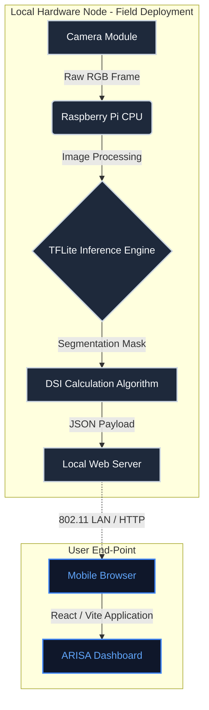
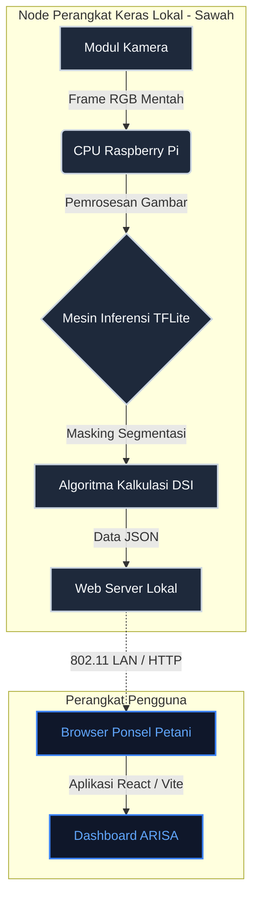

<div align="center">
  

  <h1>ARISA: Agronomic Risk Intelligence & Sensing Apparatus</h1>
  <p><strong>An Edge-AI Driven IoT Framework for Precision Agriculture and Autonomous Disease Detection in Air-Gapped Environments.</strong></p>
  <p><i>Sistem Deteksi Penyakit Padi Berbasis Edge-AI untuk Ekosistem Pertanian Pintar Tanpa Internet.</i></p>

  <p>
    Official Submission for <b>Olimpiade Penelitian Siswa Indonesia (OPSI) 2026</b>.<br>
    <i>Center for National Achievement (Puspresnas), Ministry of Education, Culture, Research, and Technology of the Republic of Indonesia.</i>
  </p>

  <p>
    <a href="https://github.com/Pixel-XXhan/KaleoSite/blob/main/LICENSE"></a>
    
    
    
    
    <br><br>
    
    
    
    
    
  </p>
</div>

---

<div align="center">
  <h3>🌍 Language Selection / Pilihan Bahasa</h3>
  <h2><a href="#-english-version">🇬🇧 English Version</a> | <a href="#-versi-indonesia">🇮🇩 Versi Indonesia</a></h2>
</div>

---

# 🇬🇧 ENGLISH VERSION

## Table of Contents (English)
1. [Official OPSI 2026 Documentation](#i-official-opsi-2026-documentation)
2. [Abstract](#ii-abstract)
3. [Introduction](#iii-introduction)
4. [System Architecture](#iv-system-architecture)
5. [Artificial Intelligence Methodology](#v-artificial-intelligence-methodology)
6. [Disease Severity Index (DSI) Quantification](#vi-disease-severity-index-dsi-quantification)
7. [Field Deployment Strategy](#vii-field-deployment-strategy)
8. [Installation & Deployment Guidelines](#viii-installation--deployment-guidelines)
9. [Alignment with Sustainable Development Goals](#ix-alignment-with-sustainable-development-goals)
10. [Limitations & Future Work](#x-limitations--future-work)
11. [License](#xi-license)
12. [Research Team](#xii-research-team)
13. [References](#xiii-references)

---

## I. Official OPSI 2026 Documentation

This repository serves as the technical artifact for the OPSI 2026 competition. The administrative and legal documents required by the Center for National Achievement (Puspresnas) are included within the `public/assets/administrasi/` directory to ensure complete transparency and academic integrity.

*   📄 [**Berkas Proposal ARISA**](public/assets/administrasi/Berkas-Proposal-ARISA.pdf) — Comprehensive research proposal, including literature review, methodology, and expected outcomes.
*   📄 [**Rancangan Anggaran Biaya (RAB)**](public/assets/administrasi/Rancangan-Anggaran-Biaya-ARISA.pdf) — Detailed financial projection for hardware acquisition and field deployment.
*   📄 [**Surat Pernyataan Keaslian Karya**](public/assets/administrasi/Pernyataan-Keaslian-Karya.pdf) — Signed legal declaration verifying the originality of the ARISA framework and codebase.
*   📄 [**Surat Pernyataan Penggunaan Kecerdasan Buatan**](public/assets/administrasi/Surat-Pernyataan-Kecerdasan-Buatan.pdf) — Formal disclosure outlining the ethical and limited use of Generative AI during the research process (strictly adhering to OPSI guidelines).
*   📄 [**Surat Rekomendasi Kepala Sekolah**](public/assets/administrasi/Rekomendasi-Kepala-Sekolah.pdf) — Institutional endorsement from SMK Marhas Margahayu.

## II. Abstract

The detection of Bacterial Leaf Blight (*Xanthomonas oryzae*) in rice crops heavily relies on manual scouting by agricultural extension workers, a methodology constrained by human error, spatial limitations, and high latency in response. This repository details the frontend implementation of **ARISA (Agronomic Risk Intelligence & Sensing Apparatus)**, a decentralized Edge-AI framework designed to perform real-time, autonomous disease quantification in air-gapped agricultural environments. By operating a local inference node on ARM64 hardware and establishing an independent ad-hoc network, ARISA eliminates the dependency on continuous internet connectivity. The system computes the Disease Severity Index (DSI) locally and serves a reactive, high-performance dashboard for immediate agronomic decision-making.

## III. Introduction

Food security is increasingly threatened by pathogenic outbreaks in staple crops. Traditional IoT solutions attempt to mitigate this by relying on cloud computing paradigms. However, the requirement for continuous internet connectivity renders these systems fundamentally unreliable in remote rural areas (blank spots). 

ARISA addresses this critical infrastructure gap through an Edge-Computing paradigm. The processing of complex computer vision algorithms is shifted entirely to the local node. The frontend dashboard documented in this repository acts as the local user interface, served directly by the hardware node to any connected mobile device within its local access point radius, effectively bridging the technological divide for smallholder farmers.

## IV. System Architecture

The ARISA framework is conceptually divided into two major operational domains: the Hardware/Inference Node and the Software/Visualization Interface.

### A. Hardware & Inference Node
*   **Processing Unit:** Raspberry Pi 4 Model B (Broadcom BCM2711, Quad-core Cortex-A72). Selected for its optimal balance of computational capability and thermal efficiency.
*   **Vision Sensor:** Raspberry Pi Camera Module V2 (Sony IMX219, 8 Megapixels).
*   **Networking:** On-board 802.11b/g/n/ac wireless LAN configured as a standalone Access Point (Hostapd/Dnsmasq), creating an isolated WLAN namespace.
*   **Enclosure:** IP65-rated industrial polycarbonate casing with active thermal management to withstand high ambient temperatures and humidity in paddy fields.

### B. Software & Visualization Interface (This Repository)
The frontend dashboard is engineered for high performance, strict type safety, and minimal rendering overhead.
*   **Core Framework:** React 18 integrated with Vite for optimized bundling and Hot Module Replacement (HMR).
*   **Language:** TypeScript, enforcing strict static typing across all data interfaces and component props to prevent runtime regressions.
*   **Styling:** Tailwind CSS, utilizing a utility-first approach to maintain a scalable, atomic design system.
*   **State Management & Motion:** Framer Motion and GSAP are employed for hardware-accelerated transitions, ensuring a fluid user experience even on low-tier mobile devices utilized by end-users in the field.



## V. Artificial Intelligence Methodology

The intelligence of ARISA is driven by a lightweight Convolutional Neural Network (CNN) optimized for constrained environments.

1.  **Architecture:** The model utilizes a U-Net topology with a MobileNetV2 backbone. This configuration drastically reduces the parameter count while maintaining a high spatial resolution for accurate lesion segmentation.
2.  **Optimization:** To achieve real-time inference (sub-500ms per frame) on the ARM Cortex-A72 CPU, the model undergoes Post-Training Quantization (PTQ), converting 32-bit floating-point weights (FP32) to 8-bit integers (INT8). This reduces memory footprint by approximately 75% with negligible accuracy loss (<1%).
3.  **Robustness & Augmentation:** The training dataset encompasses diverse lighting conditions (overcast, direct sunlight, shadows) and varied backgrounds. Geometric and photometric augmentations were applied to prevent overfitting and ensure high reliability in uncontrolled field conditions.

## VI. Disease Severity Index (DSI) Quantification

Instead of providing a binary classification (Infected/Healthy), ARISA provides a quantitative metric known as the Disease Severity Index (DSI). This enables precise, variable-rate application of agrochemicals, preventing prophylactic overuse.

The mathematical formulation for DSI calculation is defined as:

$$ DSI = \left( \frac{\sum Area_{lesion}}{\sum Area_{leaf}} \right) \times 100\% $$

Based on the calculated DSI, the dashboard triggers the following advisory states:
*   **DSI < 5%:** Low Risk. (Continuous monitoring recommended).
*   **5% ≤ DSI < 25%:** Moderate Risk. (Targeted, localized fungicide application recommended).
*   **DSI ≥ 25%:** High Risk. (Immediate systemic intervention required to prevent crop failure).

## VII. Field Deployment Strategy

Deploying sensitive computational hardware in an agricultural setting presents unique challenges. 

*   **Power Supply:** The primary node is powered by a standard 5V/3A DC supply, compatible with high-capacity lithium-ion power banks or localized solar arrays (PV). The average power draw during inference is ~6.5W.
*   **Thermal Management:** To combat CPU throttling under direct insolation, the casing is equipped with passive aluminum heatsinks and an active 5V micro-fan, ensuring core temperatures remain below 70°C.
*   **Mounting Mechanism:** The chassis utilizes a universal clamp system, allowing it to be securely affixed to bamboo poles or PVC pipes standard in Indonesian rice terraces.

## VIII. Installation & Deployment Guidelines

This section outlines the procedure for compiling and running the ARISA frontend dashboard in a local development environment.

### Prerequisites
*   Node.js (v18.0.0 or higher)
*   npm (v9.0.0 or higher) or yarn
*   Git

### Build Instructions

1.  **Repository Initialization**
    ```bash
    git clone https://github.com/Pixel-XXhan/KaleoSite.git
    cd KaleoSite
    ```

2.  **Dependency Resolution**
    Install all required dependencies as defined in `package.json`.
    ```bash
    npm install
    ```

3.  **Local Development Server Execution**
    Launch the Vite development server. This process enables Hot Module Replacement (HMR) for rapid iteration.
    ```bash
    npm run dev
    ```
    The application will be accessible via `http://localhost:5173`.

4.  **Production Compilation**
    To generate static assets optimized for deployment on the Raspberry Pi's local web server (e.g., Nginx or Lighttpd):
    ```bash
    npm run build
    ```
    The compiled output will be generated within the `/dist` directory.

## IX. Alignment with Sustainable Development Goals

The ARISA project is intrinsically aligned with the United Nations Sustainable Development Goals (SDGs), serving as a technological catalyst for sustainable agriculture:

*   **SDG 2 (Zero Hunger):** Mitigating crop yield losses by enabling preemptive intervention against catastrophic pathogenic outbreaks.
*   **SDG 9 (Industry, Innovation, and Infrastructure):** Introducing robust, decentralized Edge Computing infrastructure to rural agricultural sectors lacking conventional digital connectivity.
*   **SDG 12 (Responsible Consumption and Production):** Minimizing the ecological footprint of agriculture by preventing the prophylactic and excessive use of chemical fungicides through precise, data-driven application guidelines.

## X. Limitations & Future Work

While ARISA provides a robust foundation, several avenues for academic and technical expansion remain:
1.  **Dataset Expansion:** The current model is optimized for Bacterial Leaf Blight. Future iterations will incorporate datasets for Rice Blast (*Magnaporthe oryzae*) and Tungro virus.
2.  **Multi-Node Orchestration:** Developing a master-slave topology where multiple ARISA nodes in a massive field can communicate via LoRa (Long Range) protocols to aggregate field-wide DSI data.
3.  **Automated Sprayer Integration:** Actuating solenoid valves via Raspberry Pi GPIO to automatically dispense fungicides based on DSI thresholds, moving from a decision-support system to an autonomous intervention system.

## XI. License

This project is licensed under the MIT License.

**MIT License**
Copyright (c) 2026 ARISA Research Team

Permission is hereby granted, free of charge, to any person obtaining a copy of this software and associated documentation files (the "Software"), to deal in the Software without restriction, including without limitation the rights to use, copy, modify, merge, publish, distribute, sublicense, and/or sell copies of the Software, and to permit persons to whom the Software is furnished to do so, subject to the following conditions:

The above copyright notice and this permission notice shall be included in all copies or substantial portions of the Software.

THE SOFTWARE IS PROVIDED "AS IS", WITHOUT WARRANTY OF ANY KIND, EXPRESS OR IMPLIED, INCLUDING BUT NOT LIMITED TO THE WARRANTIES OF MERCHANTABILITY, FITNESS FOR A PARTICULAR PURPOSE AND NONINFRINGEMENT. IN NO EVENT SHALL THE AUTHORS OR COPYRIGHT HOLDERS BE LIABLE FOR ANY CLAIM, DAMAGES OR OTHER LIABILITY, WHETHER IN AN ACTION OF CONTRACT, TORT OR OTHERWISE, ARISING FROM, OUT OF OR IN CONNECTION WITH THE SOFTWARE OR THE USE OR OTHER DEALINGS IN THE SOFTWARE.

## XII. Research Team

This research is conducted by the following candidates from **SMK Marhas Margahayu** for OPSI 2026:

*   **Arief Rizal Padilah** — Principal Investigator, AI Engineering & Systems Integration.
*   **Reza** — Hardware Architecture & Energy Management Systems.
*   **Taufiq** — Agronomic Methodologies & User Experience Optimization.

## XIII. References

1.  Mew, T. W., et al. (1993). "Bacterial blight of rice." *Plant Disease*, 77(1), 5-12.
2.  Howard, A. G., et al. (2017). "MobileNets: Efficient Convolutional Neural Networks for Mobile Vision Applications." *arXiv preprint arXiv:1704.04861*.
3.  Ronneberger, O., et al. (2015). "U-Net: Convolutional Networks for Biomedical Image Segmentation." *Medical Image Computing and Computer-Assisted Intervention (MICCAI)*.

---
---

<br><br><br>

# 🇮🇩 VERSI INDONESIA

## Daftar Isi (Indonesia)
1. [Dokumentasi Resmi OPSI 2026](#i-dokumentasi-resmi-opsi-2026)
2. [Abstrak](#ii-abstrak)
3. [Latar Belakang](#iii-latar-belakang)
4. [Arsitektur Sistem](#iv-arsitektur-sistem)
5. [Metodologi Kecerdasan Buatan](#v-metodologi-kecerdasan-buatan)
6. [Kuantifikasi Disease Severity Index (DSI)](#vi-kuantifikasi-disease-severity-index-dsi)
7. [Strategi Implementasi Lapangan](#vii-strategi-implementasi-lapangan)
8. [Panduan Instalasi & Deployment](#viii-panduan-instalasi--deployment)
9. [Keselarasan dengan Tujuan Pembangunan Berkelanjutan (SDGs)](#ix-keselarasan-dengan-tujuan-pembangunan-berkelanjutan-sdgs)
10. [Keterbatasan & Rencana Pengembangan](#x-keterbatasan--rencana-pengembangan)
11. [Lisensi](#xi-lisensi)
12. [Tim Peneliti](#xii-tim-peneliti)
13. [Daftar Pustaka](#xiii-daftar-pustaka)

---

## I. Dokumentasi Resmi OPSI 2026

Repositori ini berfungsi sebagai artefak teknis untuk kompetisi OPSI 2026. Dokumen administratif dan legal yang diwajibkan oleh Pusat Prestasi Nasional (Puspresnas) disertakan dalam direktori `public/assets/administrasi/` untuk memastikan transparansi dan integritas akademik.

*   📄 [**Berkas Proposal ARISA**](public/assets/administrasi/Berkas-Proposal-ARISA.pdf) — Proposal penelitian komprehensif, mencakup tinjauan pustaka, metodologi, dan hasil yang diharapkan.
*   📄 [**Rancangan Anggaran Biaya (RAB)**](public/assets/administrasi/Rancangan-Anggaran-Biaya-ARISA.pdf) — Proyeksi finansial terperinci untuk pengadaan perangkat keras dan implementasi lapangan.
*   📄 [**Surat Pernyataan Keaslian Karya**](public/assets/administrasi/Pernyataan-Keaslian-Karya.pdf) — Deklarasi hukum yang ditandatangani untuk memverifikasi orisinalitas sistem dan kode sumber ARISA.
*   📄 [**Surat Pernyataan Penggunaan Kecerdasan Buatan**](public/assets/administrasi/Surat-Pernyataan-Kecerdasan-Buatan.pdf) — Keterangan formal mengenai penggunaan Generative AI yang etis dan terbatas selama proses penelitian (mematuhi pedoman OPSI).
*   📄 [**Surat Rekomendasi Kepala Sekolah**](public/assets/administrasi/Rekomendasi-Kepala-Sekolah.pdf) — Pengesahan institusional dari SMK Marhas Margahayu.

## II. Abstrak

Deteksi penyakit Hawar Daun Bakteri (*Xanthomonas oryzae*) pada tanaman padi saat ini sangat bergantung pada pemantauan manual oleh petugas penyuluh lapangan (PPL). Metodologi ini rentan terhadap kesalahan manusia, keterbatasan spasial, dan tingginya latensi dalam penanganan. Repositori ini menjabarkan implementasi *frontend* dari **ARISA (Agronomic Risk Intelligence & Sensing Apparatus)**, sebuah kerangka kerja *Edge-AI* terdesentralisasi yang dirancang untuk melakukan kuantifikasi penyakit secara otonom dan *real-time* di lingkungan pertanian tanpa akses internet (air-gapped). Dengan mengoperasikan *node* inferensi lokal pada perangkat keras ARM64 dan membangun jaringan nirkabel mandiri, ARISA menghilangkan ketergantungan pada konektivitas *cloud*. Sistem ini menghitung Indeks Keparahan Penyakit (*Disease Severity Index/DSI*) secara lokal dan menyajikan *dashboard* interaktif berperforma tinggi untuk pengambilan keputusan agronomi seketika.

## III. Latar Belakang

Ketahanan pangan semakin terancam oleh wabah patogenik pada tanaman pokok. Solusi *Internet of Things* (IoT) tradisional mencoba mengatasi hal ini dengan mengandalkan komputasi awan (*cloud computing*). Namun, keharusan akan koneksi internet yang stabil membuat sistem-sistem ini pada dasarnya tidak dapat diandalkan di daerah pedesaan terpencil yang seringkali menjadi area *blank spot*.

ARISA mengatasi kesenjangan infrastruktur kritis ini melalui paradigma komputasi *Edge*. Pemrosesan algoritma *computer vision* yang kompleks digeser sepenuhnya ke *node* lokal di lapangan. *Dashboard frontend* yang didokumentasikan dalam repositori ini bertindak sebagai antarmuka pengguna lokal, disajikan langsung oleh *node* perangkat keras ke perangkat seluler petani mana pun yang berada dalam radius *Access Point* lokalnya, sehingga secara efektif menjembatani kesenjangan teknologi bagi petani kecil.

## IV. Arsitektur Sistem

Kerangka kerja ARISA secara konseptual dibagi menjadi dua domain operasional utama: Perangkat Keras/*Node* Inferensi dan Perangkat Lunak/Antarmuka Visualisasi.

### A. Perangkat Keras & Node Inferensi
*   **Unit Pemrosesan:** Raspberry Pi 4 Model B (Broadcom BCM2711, Quad-core Cortex-A72). Dipilih karena keseimbangan optimal antara kemampuan komputasi dan efisiensi termal.
*   **Sensor Visual:** Modul Kamera Raspberry Pi V2 (Sony IMX219, 8 Megapiksel).
*   **Jaringan:** Wireless LAN 802.11b/g/n/ac *on-board* yang dikonfigurasi sebagai *Access Point* mandiri (Hostapd/Dnsmasq), menciptakan jaringan WLAN terisolasi.
*   **Enklosur:** Kotak polikarbonat industri bersertifikasi IP65 dengan manajemen termal aktif untuk menahan suhu lingkungan yang tinggi dan kelembapan ekstrem di area persawahan.

### B. Perangkat Lunak & Antarmuka Visualisasi (Repositori Ini)
*Dashboard frontend* direkayasa untuk kinerja tinggi, keamanan tipe data yang ketat, dan beban *rendering* yang minimal.
*   **Kerangka Utama:** React 18 yang diintegrasikan dengan Vite untuk proses *bundling* yang optimal dan *Hot Module Replacement* (HMR).
*   **Bahasa:** TypeScript, memberlakukan pengetikan statis yang ketat (*strict static typing*) di seluruh antarmuka data dan prop komponen untuk mencegah regresi *runtime*.
*   **Styling:** Tailwind CSS, menggunakan pendekatan *utility-first* untuk mempertahankan sistem desain atomik yang skalabel.
*   **Manajemen Status & Animasi:** Framer Motion dan GSAP digunakan untuk transisi yang diakselerasi perangkat keras (*hardware-accelerated*), memastikan pengalaman pengguna yang sangat mulus bahkan pada ponsel spesifikasi rendah yang umum digunakan di lapangan.



## V. Metodologi Kecerdasan Buatan

Kecerdasan ARISA didorong oleh *Convolutional Neural Network* (CNN) berbobot ringan yang dioptimalkan untuk lingkungan dengan daya komputasi terbatas.

1.  **Arsitektur:** Model ini menggunakan topologi U-Net dengan *backbone* MobileNetV2. Konfigurasi ini secara drastis mengurangi jumlah parameter sambil mempertahankan resolusi spasial yang tinggi untuk segmentasi lesi penyakit yang akurat.
2.  **Optimasi:** Untuk mencapai inferensi *real-time* (di bawah 500ms per frame) pada CPU ARM Cortex-A72, model menjalani proses *Post-Training Quantization* (PTQ), mengubah bobot angka desimal 32-bit (FP32) menjadi bilangan bulat 8-bit (INT8). Ini memangkas memori hingga 75% dengan penurunan akurasi yang dapat diabaikan (<1%).
3.  **Ketahanan & Augmentasi:** Dataset pelatihan mencakup berbagai kondisi pencahayaan (mendung, sinar matahari langsung, bayangan) dan latar belakang yang bervariasi. Augmentasi geometris dan fotometris diterapkan untuk mencegah *overfitting* dan memastikan keandalan tinggi dalam kondisi lapangan yang tidak terkendali.

## VI. Kuantifikasi Disease Severity Index (DSI)

Alih-alih sekadar memberikan klasifikasi biner (Terinfeksi/Sehat), ARISA menyediakan metrik kuantitatif yang dikenal sebagai Indeks Keparahan Penyakit (*Disease Severity Index/DSI*). Hal ini memungkinkan penerapan bahan kimia agro (fungisida) secara presisi dengan takaran yang bervariasi (*variable-rate application*), mencegah penggunaan berlebih yang merusak ekosistem.

Formulasi matematis untuk perhitungan DSI didefinisikan sebagai:

$$ DSI = \left( \frac{\sum Area_{lesion}}{\sum Area_{leaf}} \right) \times 100\% $$

Berdasarkan DSI yang dihitung, *dashboard* memicu status peringatan berikut:
*   **DSI < 5%:** Risiko Rendah. (Pemantauan rutin direkomendasikan).
*   **5% ≤ DSI < 25%:** Risiko Sedang. (Penyemprotan fungisida secara terlokalisasi sangat dianjurkan).
*   **DSI ≥ 25%:** Risiko Tinggi. (Intervensi sistemik segera diperlukan untuk mencegah penyebaran masif dan gagal panen).

## VII. Strategi Implementasi Lapangan

Menerapkan perangkat keras komputasional sensitif dalam lingkungan pertanian menghadirkan tantangan unik.

*   **Catu Daya:** Node utama ditenagai oleh pasokan DC 5V/3A standar, kompatibel dengan *power bank* lithium-ion berkapasitas tinggi atau panel surya (PV) mini lokal. Konsumsi daya rata-rata selama inferensi AI adalah sekitar 6.5 Watt.
*   **Manajemen Termal:** Untuk melawan *CPU throttling* (penurunan performa akibat panas) di bawah terik matahari, casing dilengkapi dengan *heatsink* aluminium pasif dan kipas mikro 5V aktif, memastikan suhu inti CPU tetap di bawah 70°C.
*   **Mekanisme Pemasangan:** Sasis menggunakan sistem penjepit universal, memungkinkannya untuk dipasang dengan kuat pada tiang bambu atau pipa PVC yang merupakan perlengkapan standar di persawahan terasering Indonesia.

## VIII. Panduan Instalasi & Deployment

Bagian ini menguraikan prosedur untuk mengkompilasi dan menjalankan *frontend dashboard* ARISA di lingkungan pengembangan lokal (*local computer*).

### Prasyarat
*   Node.js (v18.0.0 atau lebih tinggi)
*   npm (v9.0.0 atau lebih tinggi) atau yarn
*   Git

### Instruksi Build

1.  **Inisialisasi Repositori**
    ```bash
    git clone https://github.com/Pixel-XXhan/KaleoSite.git
    cd KaleoSite
    ```

2.  **Resolusi Dependensi**
    Instal semua paket yang diperlukan seperti yang didefinisikan dalam `package.json`.
    ```bash
    npm install
    ```

3.  **Eksekusi Server Pengembangan (Development)**
    Luncurkan server Vite. Proses ini mengaktifkan *Hot Module Replacement* (HMR) untuk iterasi visual yang cepat.
    ```bash
    npm run dev
    ```
    Aplikasi dapat diakses melalui browser di alamat `http://localhost:5173`.

4.  **Kompilasi Produksi (Production Build)**
    Untuk menghasilkan aset statis yang dioptimalkan guna di-*deploy* pada *web server* lokal Raspberry Pi (misal: Nginx atau Lighttpd):
    ```bash
    npm run build
    ```
    Hasil kompilasi akan otomatis dibuat di dalam direktori `/dist`.

## IX. Keselarasan dengan Tujuan Pembangunan Berkelanjutan (SDGs)

Proyek ARISA secara intrinsik selaras dengan Tujuan Pembangunan Berkelanjutan (SDGs) Perserikatan Bangsa-Bangsa, berfungsi sebagai katalis teknologi untuk pertanian yang *sustainable*:

*   **SDG 2 (Zero Hunger / Tanpa Kelaparan):** Memitigasi kehilangan hasil panen dengan memungkinkan intervensi pencegahan terhadap wabah patogenik katastropik secara dini.
*   **SDG 9 (Industry, Innovation, and Infrastructure / Industri, Inovasi, & Infrastruktur):** Memperkenalkan infrastruktur *Edge Computing* yang terdesentralisasi ke sektor pertanian pedesaan yang tidak memiliki konektivitas digital konvensional.
*   **SDG 12 (Responsible Consumption and Production / Konsumsi & Produksi Bertanggung Jawab):** Meminimalkan jejak ekologis pertanian dengan mencegah penggunaan fungisida kimia secara berlebihan (*prophylactic*) melalui panduan aplikasi berbasis data yang presisi.

## X. Keterbatasan & Rencana Pengembangan

Meskipun ARISA memberikan fondasi komputasi yang kuat, ada beberapa jalan untuk ekspansi akademik dan teknis di masa depan:
1.  **Ekspansi Dataset:** Model saat ini sangat dioptimalkan khusus untuk Hawar Daun Bakteri (HDB). Iterasi masa depan akan memasukkan dataset multivariabel untuk penyakit Patah Leher (*Rice Blast / Magnaporthe oryzae*) dan virus Tungro.
2.  **Orkestrasi Multi-Node:** Mengembangkan topologi *master-slave* di mana banyak perangkat ARISA dalam lahan pertanian masif dapat berkomunikasi melalui protokol LoRa (*Long Range*) untuk menggabungkan data DSI seluruh area lahan.
3.  **Integrasi Penyemprotan Otomatis (Aktuator):** Mengaktifkan katup solenoid via GPIO Raspberry Pi untuk secara otomatis menyalurkan fungisida berdasarkan ambang batas DSI absolut, beranjak dari sekadar "Sistem Pendukung Keputusan (DSS)" menjadi "Sistem Intervensi Otonom".

## XI. Lisensi

Proyek ini dilisensikan di bawah Lisensi MIT.

**MIT License**
Copyright (c) 2026 Tim Peneliti ARISA

Dengan ini diberikan izin, secara gratis, kepada siapa pun yang mendapatkan salinan perangkat lunak ini dan file dokumentasi terkait ("Perangkat Lunak"), untuk memperlakukan Perangkat Lunak tanpa batasan, termasuk hak untuk menggunakan, menyalin, mengubah, menggabungkan, menerbitkan, mendistribusikan, mensublisensikan, dan/atau menjual salinan Perangkat Lunak, dengan syarat pemberitahuan hak cipta di atas dicantumkan dalam semua salinan.

PERANGKAT LUNAK DISEDIAKAN "APA ADANYA", TANPA JAMINAN DALAM BENTUK APA PUN, TERSURAT MAUPUN TERSIRAT, TERMASUK NAMUN TIDAK TERBATAS PADA JAMINAN KELAYAKAN UNTUK DIPERDAGANGKAN, KESESUAIAN UNTUK TUJUAN TERTENTU DAN TIDAK ADANYA PELANGGARAN. DALAM KEADAAN APA PUN PENULIS ATAU PEMEGANG HAK CIPTA TIDAK BERTANGGUNG JAWAB ATAS KLAIM, KERUSAKAN ATAU KEWAJIBAN LAINNYA, BAIK DALAM TINDAKAN KONTRAK, KEALPAAN ATAU LAINNYA, YANG TIMBUL DARI, LUAR ATAU DALAM HUBUNGANNYA DENGAN PERANGKAT LUNAK ATAU PENGGUNAAN ATAU TRANSAKSI LAINNYA DALAM PERANGKAT LUNAK.

## XII. Tim Peneliti

Penelitian ekstensif ini dilakukan oleh kandidat berikut dari **SMK Marhas Margahayu** untuk kompetisi tingkat nasional OPSI 2026:

*   **Arief Rizal Padilah** — Peneliti Utama (PI), Rekayasa AI & Integrasi Sistem (Frontend/Backend).
*   **Reza** — Arsitektur Perangkat Keras, Topologi Jaringan & Sistem Manajemen Energi.
*   **Taufiq** — Metodologi Agronomi, Akuisisi Data Lapangan & Optimasi Pengalaman Pengguna (UI/UX).

## XIII. Daftar Pustaka

1.  Mew, T. W., Alvarez, A. M., Leach, J. E., & Swings, J. (1993). "Focus on bacterial blight of rice." *Plant Disease*, 77(1), 5-12.
2.  Howard, A. G., Zhu, M., Chen, B., Kalenichenko, D., Wang, W., Weyand, T., ... & Adam, H. (2017). "MobileNets: Efficient Convolutional Neural Networks for Mobile Vision Applications." *arXiv preprint arXiv:1704.04861*.
3.  Ronneberger, O., Fischer, P., & Brox, T. (2015). "U-Net: Convolutional Networks for Biomedical Image Segmentation." *International Conference on Medical Image Computing and Computer-Assisted Intervention (MICCAI)*. Springer, Cham.
4.  Jacob, B., Kligys, S., Chen, B., Zhu, M., Tang, M., Howard, A., ... & Adam, H. (2018). "Quantization and Training of Neural Networks for Efficient Integer-Arithmetic-Only Inference." *Proceedings of the IEEE Conference on Computer Vision and Pattern Recognition (CVPR)*.

---
---
<div align="center">
  <i>Dokumen ini dikompilasi secara eksklusif untuk proses evaluasi resmi Olimpiade Penelitian Siswa Indonesia (OPSI) 2026.</i>
</div>
