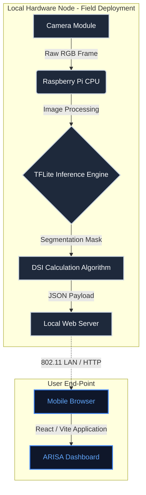

<div align="center">
  

  <h1>ARISA: Agronomic Risk Intelligence & Sensing Apparatus</h1>
  <p><strong>An Edge-AI Driven IoT Framework for Precision Agriculture and Autonomous Disease Detection in Air-Gapped Environments.</strong></p>

  <p>
    Research Candidate for <b>Olimpiade Penelitian Siswa Indonesia (OPSI) 2026</b>.<br>
  </p>

  <p>
    <a href="https://github.com/Pixel-XXhan/KaleoSite/blob/main/LICENSE"></a>
    
    
    
    <br>
    <br>
    
    
    
    
    
  </p>
</div>

<br>

## Table of Contents
1. [Abstract](#i-abstract)
2. [Introduction](#ii-introduction)
3. [System Architecture](#iii-system-architecture)
4. [Artificial Intelligence Methodology](#iv-artificial-intelligence-methodology)
5. [Disease Severity Index (DSI) Quantification](#v-disease-severity-index-dsi-quantification)
6. [Installation & Deployment Guidelines](#vi-installation--deployment-guidelines)
7. [Alignment with Sustainable Development Goals](#vii-alignment-with-sustainable-development-goals)
8. [License](#viii-license)
9. [Research Team](#ix-research-team)
10. [References](#x-references)

---

## I. Abstract

The detection of Bacterial Leaf Blight (*Xanthomonas oryzae*) in rice crops heavily relies on manual scouting by agricultural extension workers, a methodology constrained by human error, spatial limitations, and high latency in response. This repository details the frontend implementation of **ARISA (Agronomic Risk Intelligence & Sensing Apparatus)**, a decentralized Edge-AI framework designed to perform real-time, autonomous disease quantification in air-gapped agricultural environments. By operating a local inference node on ARM64 hardware and establishing an independent ad-hoc network, ARISA eliminates the dependency on continuous internet connectivity. The system computes the Disease Severity Index (DSI) locally and serves a reactive, high-performance dashboard for immediate agronomic decision-making.

## II. Introduction

Food security is increasingly threatened by pathogenic outbreaks in staple crops. Traditional IoT solutions attempt to mitigate this by relying on cloud computing paradigms. However, the requirement for continuous internet connectivity renders these systems fundamentally unreliable in remote rural areas (blank spots). 

ARISA addresses this critical infrastructure gap through an Edge-Computing paradigm. The processing of complex computer vision algorithms is shifted entirely to the local node. The frontend dashboard documented in this repository acts as the local user interface, served directly by the hardware node to any connected mobile device within its local access point radius.

## III. System Architecture

The ARISA framework is conceptually divided into two major operational domains: the Hardware/Inference Node and the Software/Visualization Interface.

### A. Hardware & Inference Node
*   **Processing Unit:** Raspberry Pi 4 Model B (Broadcom BCM2711, Quad-core Cortex-A72).
*   **Vision Sensor:** Raspberry Pi Camera Module V2 (Sony IMX219, 8 Megapixels).
*   **Networking:** On-board 802.11b/g/n/ac wireless LAN configured as a standalone Access Point (Hostapd/Dnsmasq).
*   **Enclosure:** IP65-rated industrial polycarbonate casing with active thermal management to withstand high ambient temperatures and humidity in paddy fields.

### B. Software & Visualization Interface (This Repository)
The frontend dashboard is engineered for high performance, strict type safety, and minimal rendering overhead.
*   **Core Framework:** React 18 integrated with Vite for optimized bundling and Hot Module Replacement (HMR).
*   **Language:** TypeScript, enforcing strict static typing across all data interfaces and component props.
*   **Styling:** Tailwind CSS, utilizing a utility-first approach to maintain a scalable and modular design system.
*   **State Management & Motion:** Framer Motion and GSAP are employed for hardware-accelerated transitions, ensuring a fluid user experience even on low-end mobile devices utilized by end-users in the field.



## IV. Artificial Intelligence Methodology

The intelligence of ARISA is driven by a lightweight Convolutional Neural Network (CNN) optimized for constrained environments.

1.  **Architecture:** The model utilizes a U-Net topology with a MobileNetV2 backbone. This configuration drastically reduces the parameter count while maintaining a high spatial resolution for accurate lesion segmentation.
2.  **Optimization:** To achieve real-time inference (sub-500ms per frame) on the ARM Cortex-A72 CPU, the model undergoes Post-Training Quantization (PTQ), converting 32-bit floating-point weights (FP32) to 8-bit integers (INT8).
3.  **Robustness:** The training dataset encompasses diverse lighting conditions (overcast, direct sunlight, shadows) and varied backgrounds to prevent overfitting and ensure high reliability in uncontrolled field conditions.

## V. Disease Severity Index (DSI) Quantification

Instead of providing a binary classification (Infected/Healthy), ARISA provides a quantitative metric known as the Disease Severity Index (DSI). This enables precise, variable-rate application of agrochemicals.

The mathematical formulation for DSI calculation is defined as:

$$ DSI = \left( \frac{\sum Area_{lesion}}{\sum Area_{leaf}} \right) \times 100\% $$

Based on the calculated DSI, the dashboard triggers the following advisory states:
*   **DSI < 5%:** Low Risk (Monitor).
*   **5% ≤ DSI < 25%:** Moderate Risk (Targeted application recommended).
*   **DSI ≥ 25%:** High Risk (Immediate systemic intervention required).

## VI. Installation & Deployment Guidelines

This section outlines the procedure for compiling and running the ARISA frontend dashboard in a development environment.

### Prerequisites
*   Node.js (v18.0.0 or higher)
*   npm (v9.0.0 or higher) or yarn
*   Git

### Build Instructions

1.  **Repository Initialization**
    ```bash
    git clone https://github.com/Pixel-XXhan/KaleoSite.git
    cd KaleoSite
    ```

2.  **Dependency Resolution**
    Install all required dependencies as defined in `package.json`.
    ```bash
    npm install
    ```

3.  **Local Development Server Execution**
    Launch the Vite development server. This process enables Hot Module Replacement for rapid iteration.
    ```bash
    npm run dev
    ```
    The application will be accessible via `http://localhost:5173`.

4.  **Production Compilation**
    To generate static assets optimized for deployment on the Raspberry Pi's local web server (e.g., Nginx or Lighttpd):
    ```bash
    npm run build
    ```
    The compiled output will be generated within the `/dist` directory.

## VII. Alignment with Sustainable Development Goals

The ARISA project is intrinsically aligned with the United Nations Sustainable Development Goals (SDGs), serving as a technological catalyst for sustainable agriculture:

*   **SDG 2 (Zero Hunger):** Mitigating crop yield losses by enabling preemptive intervention against catastrophic pathogenic outbreaks.
*   **SDG 9 (Industry, Innovation, and Infrastructure):** Introducing robust, decentralized Edge Computing infrastructure to rural agricultural sectors lacking conventional digital connectivity.
*   **SDG 12 (Responsible Consumption and Production):** Minimizing the ecological footprint of agriculture by preventing the prophylactic and excessive use of chemical fungicides through precise, data-driven application guidelines.

## VIII. License

This project is licensed under the MIT License.

**MIT License**
Copyright (c) 2026 ARISA Research Team

Permission is hereby granted, free of charge, to any person obtaining a copy of this software and associated documentation files (the "Software"), to deal in the Software without restriction, including without limitation the rights to use, copy, modify, merge, publish, distribute, sublicense, and/or sell copies of the Software, and to permit persons to whom the Software is furnished to do so, subject to the following conditions:

The above copyright notice and this permission notice shall be included in all copies or substantial portions of the Software.

THE SOFTWARE IS PROVIDED "AS IS", WITHOUT WARRANTY OF ANY KIND, EXPRESS OR IMPLIED, INCLUDING BUT NOT LIMITED TO THE WARRANTIES OF MERCHANTABILITY, FITNESS FOR A PARTICULAR PURPOSE AND NONINFRINGEMENT. IN NO EVENT SHALL THE AUTHORS OR COPYRIGHT HOLDERS BE LIABLE FOR ANY CLAIM, DAMAGES OR OTHER LIABILITY, WHETHER IN AN ACTION OF CONTRACT, TORT OR OTHERWISE, ARISING FROM, OUT OF OR IN CONNECTION WITH THE SOFTWARE OR THE USE OR OTHER DEALINGS IN THE SOFTWARE.

## IX. Research Team

This research is conducted by the following candidates from **SMK Marhas Margahayu** for OPSI 2026:

*   **Arief Rizal Padilah** — Principal Investigator, AI Engineering & Systems Integration.
*   **Reza** — Hardware Architecture & Energy Management Systems.
*   **Taufiq** — Agronomic Methodologies & User Experience Optimization.

## X. References

1.  Mew, T. W., et al. (1993). "Bacterial blight of rice." *Plant Disease*, 77(1), 5-12.
2.  Howard, A. G., et al. (2017). "MobileNets: Efficient Convolutional Neural Networks for Mobile Vision Applications." *arXiv preprint arXiv:1704.04861*.
3.  Ronneberger, O., et al. (2015). "U-Net: Convolutional Networks for Biomedical Image Segmentation." *Medical Image Computing and Computer-Assisted Intervention (MICCAI)*.

---
<div align="center">
  <i>Document compiled for the official evaluation of the Indonesian Student Research Olympiad (OPSI) 2026.</i>
</div>
